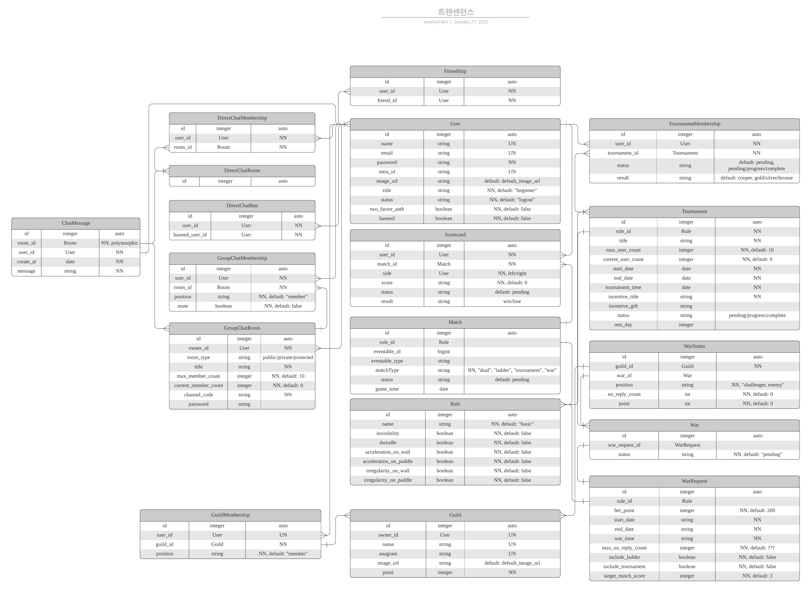

# 설계

| 날짜 | 내 | 링크 |
| :--- | :--- | :--- |
| 2021. 01. 24 | 프론트 디자 | \*\*\*\*[**프론트 디자인**](https://simian114.gitbook.io/blog/42seoul-1/ft_transcendence/undefined/0.)\*\*\*\* |
| 2021. 01. 25 | BackBoneJS 뷰 객체 설 | \*\*\*\*[**뷰 객체**](https://simian114.gitbook.io/blog/42seoul-1/ft_transcendence/undefined/1.-backbonejs)\*\*\*\* |
| 2021. 01. 26 | API 설계  |  |
| 2021. 01. 27 | DB설계 \| API 레일즈 라우팅 구현 |  |
| 2021. 01. 28 | API 라우팅 파일 구현 종료 \| 뷰 작성 | [API 설계 테이블](https://www.notion.so/3ab4d360e9324ae0a4e2161ce3ecd86e?v=708462e3ea014b36bb3689eabdee41c2) |
| 2021. 01. 29 | main 페이지 만들기  | [메인페이지](https://github.com/transcendentalists/ft_transcendence) |

## 

## 4. DB 설계

## 

