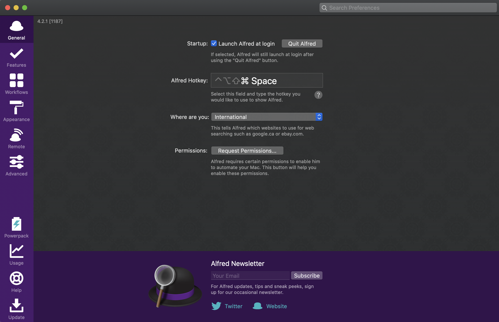
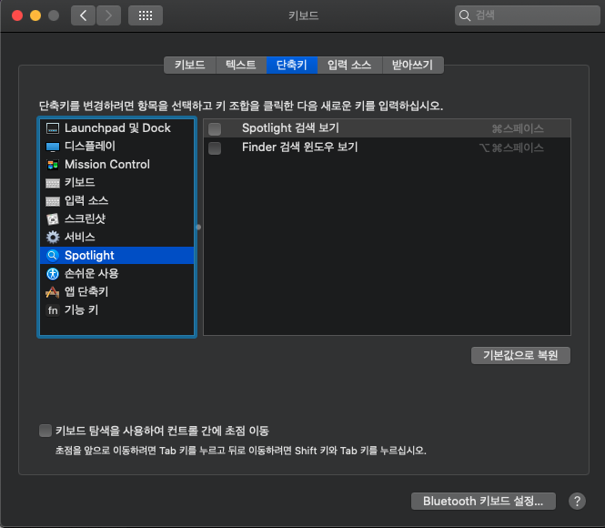
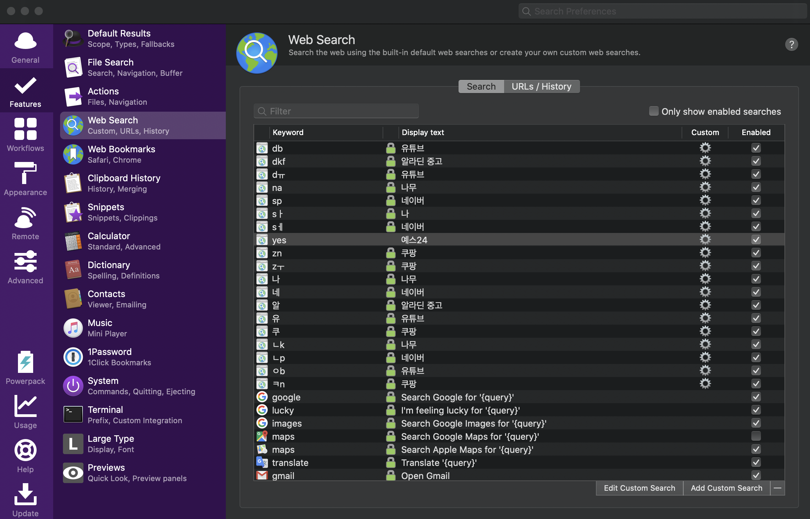
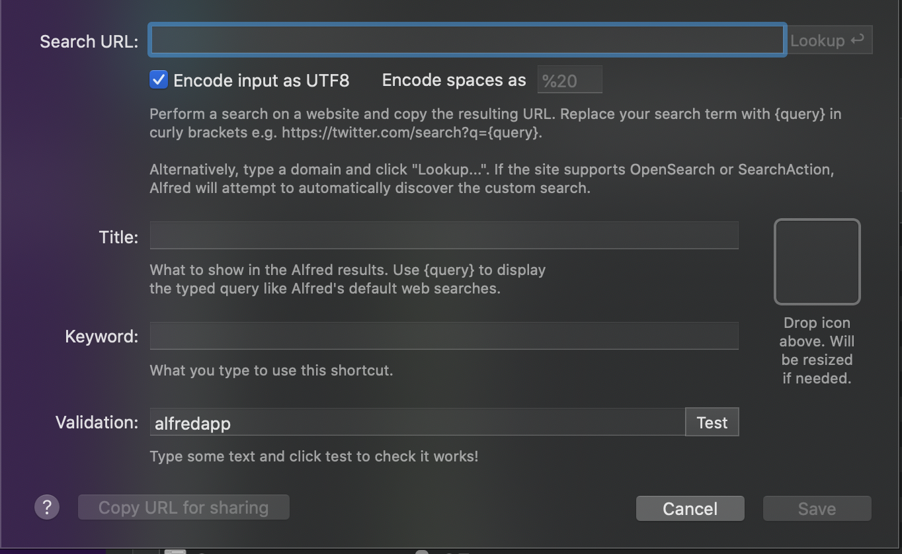

# Alfred - Spotlight 업그레이드

## Spotlight 은 웹검색을 못한다...

`spotlight`는 정말 너무 편리한 앱이다. 이 편리함에 반해 `window`에도 스팟라이트와 같은 프로그램을 설치했다. 바로 [wox](http://www.wox.one/) 다. 이 프로그램을 세팅하고 아주 잠깐 사용한 후에 느낀 점은... 그동안 너무 편리했었던 `spotlight`가 구리다는거다ㅋㅋㅋ `WOX`의 기능은 정말 무수히 많았지만 그 중에서 내게 가장 와닿았던건 웹서핑 기능이었다. 기존에 `spotlight`는 웹 브라우저를 실행시킬 수는 있었지만, `spotlight` 자체에서는 검색을 할 수는 없었다. 따라서 이 기능을 충족시켜 줄 MAC 용 앱을 찾아봤고 `Alfred`를 찾았다!

## 설치 방법

#### 1. [공식 홈페이지](https://www.alfredapp.com/) 에서 설치하자. `PowerPack`라고 유료 버전도 있지만 굳이 사용할 필요는 없다.

#### 2. 실행하고 설정에 들어가자.

#### 3. 가장 먼저 해줘야 할 것 `General` 탭에 가서 `Hot Key`를 수정하는 것.

* 바뀌지 않는다면 `시스템 환경설정`의 `spotlight`핫 키 설정을 직접 꺼주자.

#### 4.  `Feature` 탭의 `Web Search`에 들어가서 웹 서핑 관련 설정을 해주자. 오른 쪽 하단을 보면 `Add Custom Search`가 있다. 클릭해주자

#### 5. 마지막 설정을 해주자!

* `Search URL`: 검색엔진을 설정한다. ex\) `naver, 쿠팡, 유튜브 등등..`
* `Keyword`: 해당 `URL`로 서칭할 키워드를 정한다. 만약 키워드가 `na` 로 `Search URL`이 네이버면 `na 남상혁`을 검색하면 네이버에서 남상혁이 검색됨.
* `Title`: 그냥 사이트 이름으로 해주자

### 6. 끝! 행복한 웹서핑~

