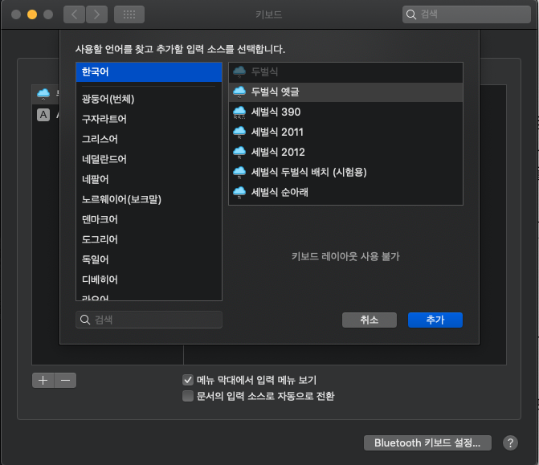
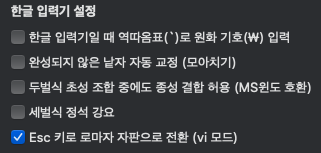

# 구름 입력기 - ESC, \`

순정맥에서는 `VIM` 사용중에 `ESC`를 눌러도 영어 전환이 되지 않는 불편점이 있다. 다양한 해결 방법이 존재하는거 같지만..

1. `Karabiner-elements`
2. `HammerSpoon`
3. `BetterTouchTool`
4. `구름`

나는 `구름` 을 이용해서 해결했다. 나머지 방법으로도 시도는 해봤지만 다 무용지물.. 시간만 너무 버렸다.

### 사용법

#### 1. [구름입력기 공식 홈페이지](http://gureum.io/#install) 에 접속 후 최신 버전을 다운받고 설치한다.

#### 2. 이후 키보드 설정으로 가서 구름 입력소스를 추가한다. \(기존에 있던 두벌식은 지우자\)

#### 3. 오른쪽 구석탱이에서 `구름`을 누르면 설정을 열 수 있다. 

#### 4. 환경설정 누르고 아래처럼 세팅해주자  

