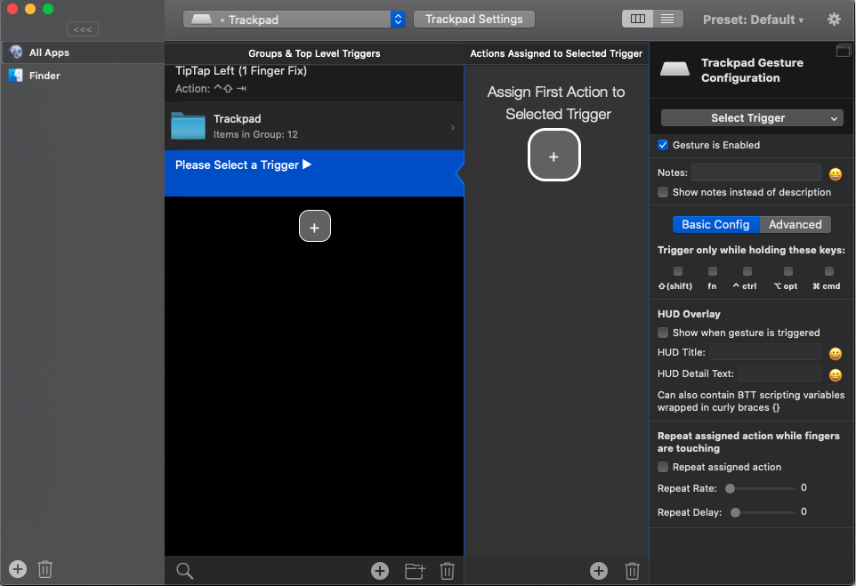

# BetterTouchTool - 트랙패드

### 1. 설치 및 환경설정

일단 순정맥의 트랙패드는 정말 쓸모없다... 윈도우보다도 못한 느낌 그러면 어떻게 사용해야하냐?!

`BetterTouchTool` 이라는 앱과 사용하면 된다. 이 앱은 모든 입력장치에 대해 숏컷을 만들어 주는 엄청난 앱이다. 유료지만 45일간 체험기간을 주니 부담없이 사용하자. 설치 후 설정창에 접속하자. 그러면 아래와 같이 무섭게 생긴 창이 뜬다.   
 

### 2. 입력장치 선택

* 맨 위에 있다.
* 숏컷을 만들어줄 입력장치를 선택하자.
* 나는 트랙패드를 선택

### 3. 메인화면을 보면 3개의 창이 있다.

| Group & ... | Actions ... | Last |
| :--- | :--- | :--- |
| 먼저 여길 선택 \(+\) |  |  |

1. 이후 3번 째 열에서 `Select Trigger`를 누르자. 트랙패드의 어느 부분을 어떻게 누르면 트리거가 동작하는지 설정해주는 것.
2. 가운데 열을 누르면 `Action`을 선택할 수 있다.
   * 화면 리사이징, 앱 옮기기 등 다양한 동작을 선택할 수 있다.
   * 만약 직접 만든 숏컷이 있다면 `Send Keyboard ShortCut`으로 세팅하면 된다.

