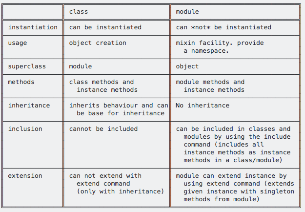

# Chapter5. 기능 공유하기

## 5.0 기능 공유하기: 상속, 모듈, 믹스인

* 좋은 설계 원칙 중 한가지는 불필요한 중복을 없애는 것이다. 어플리케이션에서 다루는 하나의 개념이 딱 한 번만 표현될 수 있도록 노력한다.
* 클래스의 모든 메서드는 자동으로 그 클래스의 모든 인스턴스에서 사용될 수 있다. 하지만 더 일반적인 공유 방법도 필요함.
* 루비에서는 기능을 공유하는 방법이 크게 두 가지가 있다. 하나는 상속이고 다른 하나는 \(모듈을 이용한\)믹스인이다.



## 5.1 상속과 메시지

* puts 메서드는 인스턴스의 `to_s` 메서드를 호출한다.

  * 우리가 직접 구현한 클래스에서 `to_s` 를 구현하지 않고 `puts` 메써드의 인자로 넣으면 어떻게 될까?
  * 어떤 값들이 출력된다! 우리는 `to_s`를 구현하지 않았는데 왜 이렇게 동작하지?
  * 이유는 `루비의 모든 것이 객체다` 라는 문구에 있다.
  * 루비는 모든 것이 객체다. 그리고 모든 것이 객체가 되기 위해서는 모든 것의 부모 뻘 되는 클래스도 있다는 것. 따라서 우리가 구현한 클래스가 명시적으로 어떤 클래스를 상속받는다고 하지 않다고 하더라고 실제로는 상속을 받고있고 그 상속 받는 클래스에 `to_s`가 구현되어 있기 때문에 `to_s`를 직접 구현하지 않아도 `puts` 메써드의 출력 결과가 나오는 것이다.

  ```ruby
  class Parent
  end
  Parent.superclass # => Object (여기에 to_s가 구현되어 있음)
  class Child < Parent
  end
  Child.superclass # => Parent
  ```

* 루비는 자기 자신에 정의되어 있지 않은 메서드를 자신의 부모에서 찾고 여기서도 없으면 부모의 부모에서 찾고... 더이상 부모가 없을 때 까지 찾는다.
* 자식 클래스는 보통 기능을 추가할 때 주로 사용된다. 만약 부모에 존재하는 메써드고 부모와 같은 동작을 한 다음에 자식에서 조금더 특화된 행동을 하길 원한다고하면 아래처럼 `super`를 사용하면 된다. `super`에 인자가 들어가면 부모메서드의 해당 메서드의 인자로 들어가게 된다.

  ```ruby
  class Parent
    def initialize(val)
      puts "Parent's val: #{val}"
    end
  end
  class Child < Parent
    def initialize(val)
      super(val)
      puts "child!"
    end
  end

  p = Parent(10)
  c = Child(20)
  ```

### 5.2 모듈

* 모듈은 메서드와 클래스, 상수를 함께 하나로 묶는 수단이다. 모듈은 다음과 같은 장점이 있다.
  1. 모듈은 이름 공간을 제공해서 이름이 충돌하는 것을 막아준다.
  2. 모듈은 믹스인 기능을 구현하는데 사용한다.

#### 이름 공간

* 루비로 큰 프로그램들을 작성하기 시작하면 자연스럽게 재사용 가능한 코드들의 묶음, 즉 범용적으로 사용할 수 있는 루틴들의 라이브러리를 만들게 될 것임.
  * 그리고 이런 코드들을 별도 파일로 분리하여 다른 루비 프로그램에서도 함께 사용하기를 원하게 될 것이다.
  * 이런 코드들은 보통 클래스로 이루어지기 때문에, 각 클래스를 파일에 나눠 담을 것임.
  * 하지만 _**클래스 형태를 지니지 않는 코드들을 함께 묶어줘야 하는 경우도 있다.**_
  * 이럴 때 모듈을 사용함.
* 모듈이란 다른 메서드나 상수에 의해 방해 받을 염려 없이 메서드와 상수를 정의할 수 있는 일종의 샌드박스다.
* 아래처럼 사용할 수 있다.

```ruby
module Trig
  PI = 3.141592...
  def Trig.sin(x)
    puts x
  end
  class Mo
    def initialize
      puts "Module!"
    end
  end
end

class Test
  include Trig
  def initialize
    puts Trig::PI
    @m = Trig::Mo.new
    Trig.sin(10)
  end
end

t = Test.new
```

## 5.3 믹스인

* 모듈에는 또 다른 훌륭한 사요법이 있다. 바로 믹스인이다.
* 믹스인을 사용하면 다중 상속을 구현해낼 수 있다.
* 모듈은 인스턴스를 가질 수 없다.
  * 클래스가 아니기 때문!
  * 하지만 클래스 선언에 모듈을 포함할 수 있다.
  * 모듈을 포함하면 이 모듈의 모든 인스턴스 메서드는 클래스의 인스턴스 메서드처럼 동작하기 시작한다.
  * 즉, 모듈이 클래스에 섞여 들어간 것. 이러한 이유로 `MIX IN` 이라는 단어로 표현한다.
  * 믹스인된 모듈은 실제론ㄴ 일종의 부모 클래스 처럼 동작한다.

### include ?

* `C`에서 `include`를 사용하면 전처리기가 나서서 해당 코드 내용을 다른 파일에 추가시킨다.
* `Ruby`에서는 `C`와 다르게 해당 _**모듈에 대한 참조**_ 를 만들 뿐이다.
* 참조다. 즉 여러 클래스가 하나의 모듈을 포함한다면\(`include`\) 이 클래스들은 모두 같은 모듈을 참조하게 된다!
  * 즉 모듈의 메서드 정의를 수정한다면 이 모듈을 포함하는 모든 클래스는 새로이 정의된 방식으로 동작하게 된다.
* 믹스인의 진정한 힘은 믹스인 되는 ㅋ드가 자신을 이용하는 클래스와 상호 작용할 때 드러난다.
* 아래의 예시에서 클래스 `SizeMatters`에는 `<=>`와 같이 비교연산자가 구현되어 있다.
  * 또한 `Comparable` 모듈이 `include` 되어 있다.
  * 만약 여기서 `Comparable` 모듈을 `include` 하지 않는다면 아래 코드는 에러가 난다.\(비교 연산자가 구현이 되어 있는데도!\)
  * 이 예시가 보여주는게 바로 모듈과 클래스의 상호작용. 상호작용을 통해 `<=>` 연산자 구현과 `Comparable` 만으로 모든 비교 연산자를 구현해낸것.

```ruby
class SizeMatters
  include Comparable
  attr :str
  def <=>(other)
    str.size <=> other.str.size
  end
  def initialize(str)
    @str = str
  end
  def inspect
    @str
  end
end

s1 = SizeMatters.new("Z")
s2 = SizeMatters.new("YY")
s3 = SizeMatters.new("XXX")
s4 = SizeMatters.new("WWWW")
s5 = SizeMatters.new("VVVVV")

s1 < s2                       #=> true
s4.between?(s1, s3)           #=> false
s4.between?(s3, s5)           #=> true
[ s3, s2, s5, s4, s1 ].sort   #=> [Z, YY, XXX, WWWW, VVVVV]
```

## 5.4 반복자와 Enumerable 모듈

* 루비의 컬렉션 클래스는 정말 많은 기능을 수행한다.
* 이 말을 다르게 하면 내가 직접 만든 클래스는 저 수많은 기능을 일일이 구현해야 한다는건가?
  * 아니다! 루비의 수 많은 기능\(map, find, select ...\)을 이용하기 위해서는 단 하나의 기능만 구현하면 된다.
  * 바로 `each`!!!
* 내가 만든 클래스가 기본 컬렉션 처럼 동작하길 원한다면 `each` 를 구현하고 `Enumerable` 모듈을 인클루드 하자!

```ruby
class Mine
  include Enumerable
  ...
  def each
    ...
  end
end
```

## 5.5 모듈 구성하기

* `Enumerable`은 표준 믹스인으로 인클루드하는 클래스의 `each` 메서드를 사용해 다양한 메서드를 구현한다.

### 모듈의 상수, 메서드 이름에서 모호함 없애기

* 상수나 메서드 이름에 모듈의 이름을 붙여서 없애는게 제일 좋을 듯.

