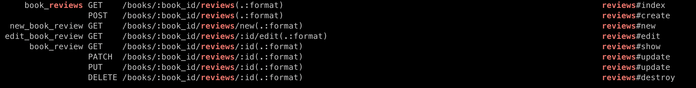
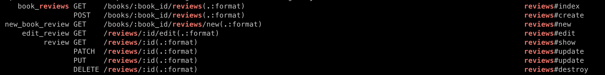

# Chapter7. 라우팅

## 7.1 RESTful 인터페이스

> RESTful 인터페이스를 잘 사용하면 통일감 있고 의미가 명확한 URL 설계가 가능하다.

* RESTful 인터페이스는 REST의 측징을 가진 라우트를 말한다.
* REST는 네트워크의 모든 컨텐츠\(리소스\)를 URL로 표현한다. 그리고 이러한 URL\(리소스\)에 HTTP 메서드 \(GET-추출, POST-생성, PATCH-변경, DELETE-제거\) 등의 방법으로 접근한다.
* _**즉, REST란 무엇\(리소스\)을 어떻게\(HTTP 메서드\)할지 표현하는 것이다.**_
* Rails 는 원칙적으로 RESTful 인터페이스를 기반으로 라우트를 설계한다.
  * 따라서 Rails에서 제공하는 `fomr_with, link_to` 등의 뷰 헤퍼는 RESTful 인터페이스를 전제로 설계 되었다.

### 7.1.1 RESTful 인터페이스의 정의

* RESTful 인터페이스를 정의할 때는 `routes.rb` 에서 `resources` 메서드를 호출한다.
* 리소스는 `CRUD` 할 수 있는 정보라고 생각하면 좋다. 아래처럼 routes.rb 파일에 `resources :name` 형식으로 입력하면 `URL` 로 액션이 매핑된다.

  * 즉, `resources` 메서드 한방으로 RESTful 인터페이스가 정의 된다는 것이다.

  ```ruby
  Railbook::Application.routes.draw do
    resources :users
    ...
    end
  ```

* | HTTP Verb | Path | Controller\#Action | Used for |
  | :--- | :--- | :--- | :--- |
  | GET | /users | users\#index | display a list of all users |
  | GET | /users/new | users\#new | return an HTML form for creating a new user |
  | POST | /users | users\#create | create a new user |
  | GET | /users/:id | users\#show | display a specific user |
  | GET | /users/:id/edit | users\#edit | return an HTML form for editing a user |
  | PATCH/PUT | /users/:id | users\#update | update a specific user |
  | DELETE | /users/:id | users\#destroy | delete a specific user |

  `resources` 메서드는 뷰 헬퍼\(`link_to`\)등 에서 사용할 수 있는 `URL 헬퍼` 도 자동으로 생성한다. 이러한 헬퍼를 사용함으로써 링크를 보다 직관적으로 사용할 수 있는 것은 물론 라우트 정의에 의존하지 않을 수도 있다.

  | 헬퍼 이름\(\_path\) | 헬퍼 이름\(\_URL\) | 리턴 값\(경로\)\) |
  | :--- | :--- | :--- |
  | users\_path | users\_url | /users |
  | user\_path\(id\) | user\_url\(id\) | /users/:id |
  | new\_user\_path | new\_user\_url | /users/new |
  | edit\_user\_path\(id\) | edit\_user\_url\(id\) | /users/:id/edit |

* `xxx_path` 와 `xxx_url` 의 차이는
  * `xxx_path` 는 상대경로
  * `xxx_url` 는 절대 경로
  * `xxx_url` 는 `format` 을 인자로 받을 수 있다. 따라서 `respond_to` 처럼 `format` 에 따라 각기 다른 응답을 해야할 때에는 `xxx_url` 을 사용한다.

### 7.1.2 하나의 리소스 정의

> resource 메서

* `resources` 는 복수형이다. 즉 여러 개의 리소스를 관리하는 RESTful 인터페이스를 생성한다.
* 반면 `resource`는 하나의 리소스를 관리하는 RESTful 인터페이스를 생성한다.
* 예를 들어 하나의 리소스는 애플리케이션의 설정 정보 등의 리소스를 말한다. 즉 애플리케이션 설정은 _**당연히**_ 그 애플리케이션에서 유일하므로 `/config/15` 가 아니라 `/config` 의 형태로 `URL`에 접근해야 할 것이다.
* `resource config`의 결과는 아래와 같다.

  | URL | 액션 | HTTP 메서드 | 역할 |
  | :--- | :--- | :--- | :--- |
  | `/config(:format)` | show | GET | 설정 정보 화면 표시 |
  | `/config/new(:format)` | new | GET | 신규 설정 등록 화면 표시 |
  | `/config(:format)` | create | POST | 등록 화면에서 입력을 받아 등록 처리 |
  | `/config/edit(:format)` | edit | GET | 기존 설정 수정 화면 표시 |
  | `/config(:format)` | update | PATCH/PUT | 수정 화면에서 입력을 받아 수정 처리 |
  | `/config(:format)` | destroy | DELETE | 지정된 설정 정보를 제거 처리 |

* `resources` 메서드와 거의 비슷하지만 `index` 액션이 정의 되지 않고, `:id`를 인자로 받지 않는다.
* 주의해야할 것은 `resource` 메서드와 매칭되는 컨트롤러는 반드시 복수형이어야 한다.
  * 즉 `config`의 컨트롤러 이름은 `ConfigsController`처럼 복수형이 되어야만 한다.
* URL 헬퍼도 생성이된다.

  | PATH | URL | 경로 |
  | :--- | :--- | :--- |
  | `config_path` | `config_url` | `/config` |
  | `new_config_path` | `new_config_path` | `/config/new` |
  | `edit_config_path` | `edit_config_path` | `/config/edit` |

### 7.1.3 라우트 정의 확인하는 법

1. 터미널에 `rails routes` 입력하기
2. 브라우저에 `localhost:3000/rails/info/routes`로 접근하기

## 7.2 RESTful 인퍼테이스의 사용자 정의화

* Rails에서는 `resources`와 `resource`메서드를 사용해 정형적인 라우트를 자동으로 생성할 수 있다. 이러한 간단함이 `RESTful` 인터페이스의 장점이다.
* 추가로 옵션을 사용해 더욱 다채롭게 사용할 수 있다.

### 7.2.1 라우트 매개 변수 제약 조건

> constraints 옵션

* `resources` 메서드로 자동 생성되는 `URL` 에는 `:id` 라는 이름의 라우트 매개 변수가 포함된다.
* 이 `:id` 라우트 매개 변수에 제약 조건을 걸 수 있다.
* 아래와 같은 명령을 입력하면 `id`의 값은 `숫자 1자리 또는 2자리로 제한된다.`

```ruby
resources :books, constraints: { id: /[0-9]{1,2}/}
```

* 다만 라우트 매개 변수와 관련된 유효성 검사는 _**모델에서 하는 것이 기본**_ 이다.

### 7.2.2 복잡한 제약 조건 설정

> 제약 클래스를 정의 하자

* 위와 같이 간단한 제약은 `resources`의 옵션에서 바로 넣을 수 있지만, 복잡한 제약 조건을 걸기 위해서는 `클래스`를 만들어야 한다.
* 순서는 아래와 같다. 아래는 9시부터 18시 까지만 라우팅이 가능한 제약을 만드는 예시.
  1. `/models` 폴더에 `TimConstraint.rb` 를 만든다.
  2. 파일이름과 같은 `클래스` 를 만들고 `match?` 메서드를 만든다.
  3. ```ruby
     class TimeConstraint
       def matches?(request)
         ... 생략
       end
     end
     ```
  4. `routes.rb`의 `resources` 에 제약을 넣으면 된다.
  5. ```ruby
     resources :books, constraints: TimeConstraint.new
     ```

### 7.2.3 format 매개 변수 제거

> Format 옵션

* `resources` 메서드로 `RESTful` 인터페이스를 만들고, 터미널에 `rails routes` 를 입력하면 라우팅 정보가 나온다.
* 이때 경로를 보면 뒤에 `(:format)` 이 붙어있는게 보인다. 이게 뭐냐면 클라이언트가 html 파일이 아닌 `.json` 이나 `.xml` 등과 같은 포맷으로 요청을 날릴 때 이 요청 또한 소화하기 위해 처리해 놓은것이다.
* 만약 서버가 이런 포맷을 원하지 않는다? 그러면 옵션을 이용해서 없애자.
* ```ruby
  resources :books, format: false
  ```
* 이후 `rails routes | grep books` 를 입력해서 `:format`이 사라진걸 확인하자

### 7.2.4 컨트롤러 클래스와 URL 헬퍼의 이름 수정

> controller, as 옵션

* `resources` 메서드는 _**기본적으로 지정된 리소스 이름을 기반으로 대응되는 컨트롤러**_를 결정하고 URL 헬퍼를 생성한다.
* 만약 기본으로 지정된 이름이 아닌 다른 이름의 컨트롤러를 매핑하고 싶다면 `controller` 옵션을 사용하자
  * ```ruby
    resources :users, controller
    ```
* `URL 헬퍼`의 이름만 바꾸고 싶다? 그러면 `ad` 옵션을 사용하자
  * ```ruby
    resources :users as members
    ```
  * 기존의 `users_path` 는 `members_path`, `user_path`는 `member_path` 등으로 변경된다.

### 7.2.5 모듈 내부의 컨트롤러를 맵핑

> namespace, scope 블록

* 컨트롤러 클래스의 수가 많아지면 모듈을 사용해 컨트롤러를 폴더로 정리해야 한다.
* 이때는 아래와 같이 컨트롤러 클래스를 생성한다.

  ```ruby
  rails generate controller Admin::Books
  ```

* 이렇게 하면 `Admin::BooksConttoller`가 `controllers/admin` 폴더에 `books_controller.rb` 라는 이름으로 생성된다.
* 이렇게 모듈을 사용한 컨트롤러 클래스에 `RESTful` 인터페이스를 정의하려면 `namespace` 블록을 사용한다.
* ```ruby
  namespace :admin do
    resources :books
  end
  ```
* 이렇게 하고 `rails routes` 를 확인해보면 `books` 앞에 `admin`이 붙은걸 확인할 수 있음.
  * 즉 너무 길어진다.
* 만약 길어지는게 싫다면 `scope` 블록을 사용하면 된다.
* ```ruby
  scope midules: :admin do
    resources :books
  end
  ```

### 7.2.6 RESTful 액션 추가

> collection과 member 블록

* `resources`로 자동 생성되는 라우투는 `CRUD`에 한정되어 있다.
* 나만의 라우트를 추가 하고 싶다면 `collection` 또는 `member` 블록을 사용하면 된다.
* `collection`
  * 이 블록은 이름만 봐도 `복수`로 표현될 라우트를 추가하는 것.
  * _**`index` 와 마찬가지로 `:id` 라우트 매개 변수가 필요 없다!**_
* `member`
  * 이 블록은 하나의 리소스를 지정해야 한다.
  * _**즉 `:id` 매개변수가 필요하다!**_
* ```ruby
  resources :reviews do
    collection do
      get :unapproval
    end
    member do
      get :draft
    end
  end
  ---결과---
  unapproval_reviews GET /reviews/unapproval(:format)
  draft_review            GET /reviews/:id/draft(:format)
  ```

### 7.2.7 RESTful 액션 무효화

> only, except 옵션

* ```ruby
  resources :users, except: [ :show, :destroy ]
  ```
* ```ruby
  resources :users, only: [ :index, :new, :create, :edit, :update ]
  ```

### 7.2.8 계층 구조를 가진 리소스 표현

> resources 메서드 중첩

* 리소스들이 애플리케이션 내부에서 계층 구조를 갖는 경우가 있다.
* 예를 들면 `book` 리소스에는 `reviews` 리소스가 포함된다.
  * `book` 은 `review`를 `has_many`
  * `review`는 `book`에 `belongs_to`
* 이러한 모델 관계는 `URL` 로도 표현해주는 것이 직관적이다. 예를 들면 `book_id: 1`의 `reviews` 를 보고 싶을 때는 `/books/1/reviews` 처럼 해주는게 우리가 생각하는 일반적인 모습과 같을 것이다.
* 이 때 사용하는게 `resources`의 중첩 구조다. 사용법과 그로인해 생기는 결과는 아래와 같다.
* ```ruby
  resources :books do
    resources :reviews
  end
  ```



* 먼저 `xxx_path` 의 이름이 기존과 다르게 `book_reviews` 와 같이 변경됐고, `path` 에 들어가는 인자도 `:id` 하나가 아닌 `book_id` 와 `:id` 두개가 되었다.
* 이렇게 만든 상태로 서버에 접근하면 서버 에러가 발생한다. 에러가 발생하는 원인은 간단하다.
  * 먼저 `reviews` 의 `html.erb` 파일들에서 사용하고 있던 `URL 헬퍼` 들이 수정되지 않은 상태다.
    * `reviews_path` 였다면 `book_reviews`로 바꿔야 한다.
* 이런 헬퍼들에 대한 인자가 2개로 바꼈다. 기존에는 `review`의 `:id` 하나면 됐지만 이제는 `book_id` 까지 넣어줘야 한다.
* 예를 들면 `reviews/index.html.erb` 파일을 아래처럼 수정해야한다.

  ```markup
  --- 변경 전 ---
  <td><%= link_to 'Show', review %></td>
  --- 변경 후 ---
  <td><%= link_to 'Show', book_review_path(book_id: review.book_id, id: review.id) %></td>
  ```

### 7.2.9 리소스의 얕은 중첩 표현

> shallow 표현

* `resources`로 중첩표현을 하면 위의 사진처럼 특정 `review`에 접근하기 위해서는 `book` 과 관련된 처리까지 해야한다.
* `shallow` 옵션을 사용하면 이 번거로움을 해결할 수 있다.
* ```ruby
  resources :books do
    resources :reviews, shallow: true
  end
  ```



* `:id` 매개 변수를 받지 않는 `index`, `new`, `create` 액션은 그대로지만
* `:id` 매개 변수를 받는 `edit`, `show`, `update` ... 등은 `book_id` 가 사라졌음을 확인할 수 있다.
* `shallow`를 하드코딩 하는 방법도 있다.

  ```ruby
  resources :books do
    resources :reviews, only: [ :index, :new, :create ]
  end
  resources :reviews, except: [ :index, :new, :create]
  ```

### 7.2.10 라우 정의 재이용

> concern 메서드와 concerns 옵션

* `concern` 메서드를 사용하면 공통되는 내용을 여러 개의 라우트 정의에 넣을 수 있다.
* ```ruby
  resources :reviews do
    get :unapproval, on: :collection
    get :draft, on: :member
  end

  resources :users do
    get :unapproval, on: :collection
    get :draft, on: :member
  end
  ```
* 위와 같은 라우트 정의는 블록 내부의 내용이 같으므로 `concern` 메서드로 분리하자.

  ```ruby
  concern :additional do
    get :unapproval, on: :collection
    get :draft. on: :member
  end

  resources :reviews, concern: :additional
  resources :users, concerns: :additional
  ```

## 7.3 RESTful 하지 않은 라우트 정의의 기본

* Rails는 기본적으로 RESTful 인터페이스로 구성된다. 하지만 모든 것을 REST의 사상에 맞춰 만들 수 있는 것은 아니다.
* 이럴 때는 무리해서 RESTful 인터페이스를 적용하려 들지 말고 간단하게 RESTful 하지 않은 라우트 정의를 사용해도 된다.
  * 무조건 RESTful 인터페이스에 따라 만드는 것이 좋은것은 아니다!

### 7.3.1 RESTful 하지 않은 라우트 정의의 기본

> match 메서드

```ruby
# match pattern, via: verb [,opts]

match ':controller(/:action(/:id))', via: [ :get, :post, :patch ]
```

* 위와 같은 형태로 패턴을 만들면 아래와 같은 패턴이 매치된다.
  * `/books`
  * `/hello/list`
  * `/blog/details/123`
  * `blog/details/123.json`
* 괄호로 감싸진 부분은 생략 가능함을 나타낸다.
* `via` 옵션은 라우트에 허용할 `HTTP 메서드` 를 지정한다.

