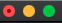
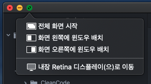
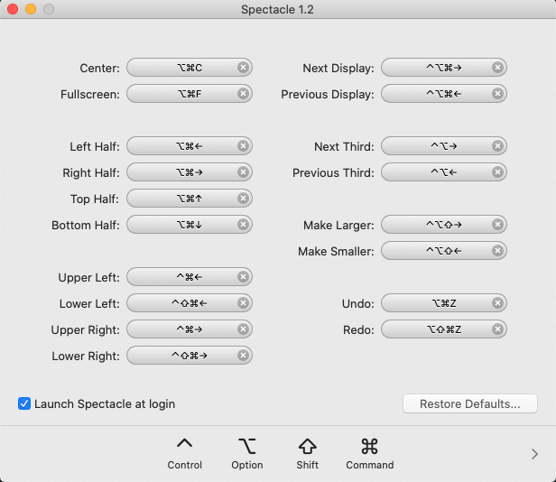

# Spectacle - 화면 분할

### 순정

1. 왼쪽 구석의 녹색 _**꾹**_ 누르기

   

2. 목록에서 원하는 위치 찾아 누르기

   

위의 방법은 치명적인 단점이 있다. 1. 키보드만으로 동작시킬 수 없다. 2. 화면에 띄울 수 있는 앱이 최대 2개다.

### [Spectacle](https://spectacleapp.com)

순정의 불편함을 해소해줄 무료앱이 있었다. 바로 `Spectacle`... [공식 홈페이지](https://github.com/hysimok) 에서 설치하고 사용자 권한을 주면 바로 실행할 수 있다. 실행하고 `preferences`를 보면 아래처럼 윈도우가 뜬다. 

 단축키를 변경할수도 있지만 기본설정이 워낙 편하게 잘되어 있어서 딱히 설정은 하지 않고 사용중이다.

> BetterTouchTool 과 함께 사용하면 더욱 좋다.

