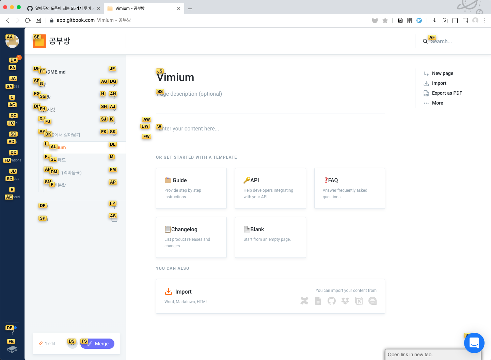
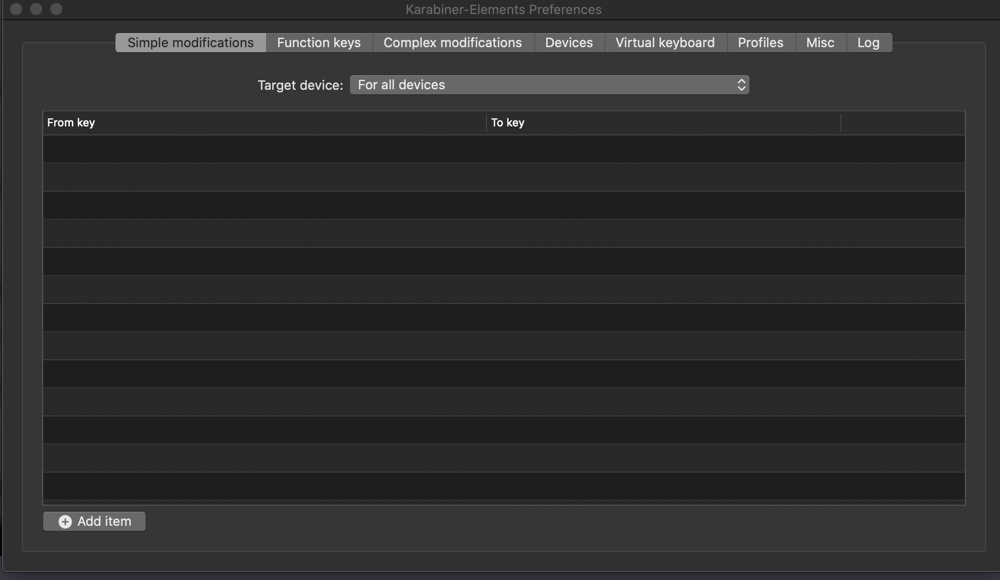

# Vimium

## Chrome

크롬\(웨일\)은 익스텐션을 추가하면 된다. 정말 많은 키를 이용할 수 있겠지만 주로 사용하는건 아래와 같다.

```text
1. h, j, k, l
2. d / u: 페이지 절반 내림/올림
3. gg / G: 페이지 맨 위/아래
4. f: 현재 페이지에서 선택할 수 있는 모든 경우를 보여주고, 숏컷으로 보여줌
```

진짜 이중에서도 최고인건 `f` 기능이다. 아래 사진은 `f`를 입력했을 때 보이는 모습이다 여기서 `se`를 입력하면 깃북의 처음화면으로 이동할 수 있다.



## MAC 전체 시스템

> 기능을 사용할 수 있는 방법이 정말 많은듯?

1. `BBT`
2. `HammerSpoon`
3. `karabiner-elements`

   위 세가지 방법중에서 나는 `karabiner-elements`를 사용해서 `MAC` 시스템에서 `Vim`을 사용할 수 있게 만들었다.

### 설치 및 사용법

* [공식 홈페이지](https://karabiner-elements.pqrs.org/)에 접속해서 다운로드 받자. 설치 이후 권한 설정이 과할정도로 많다. 귀찮아도 해주자.
* 이후에는 `preference`을 선택. 그러면 아래와 같은 창이 뜬다.   



* `Complex modifications`을 누르자. 아마 지금은 아무것도 없을거다. 이 `Complex modifications`은 유저가 직접 만들어서 사용하거나 또는 인터넷에 다른 사람들이 만들어 놓은 설정 파일을 사용할 수 있다. 나는 만들어져 있는걸 사용할거다.
* [karabiner-Complex rules](https://ke-complex-modifications.pqrs.org/?q=vim) 에 들어가자. 등록되어 있는 `vim` 모드가 정말로 많다.
* 이 중에서는 각자의 취향대로 선택해서 다운 받으면 된다. 추천 목록은 아래 두 가지다.
  * `Vim Mode Plus`
  * `Vimium`
* 원하는 걸 선택하고 `Import`를 누르자. 그러면 아까 띄어놨던 설정 창이 다시 뜬다.


* `Add rule`을 누르고 원하는 기능을 `enable` 하자.
* `import` 한 `rule`마다 사용방법이 조금씩은 다른다. `karabiner`가 동작하는 방식은 `hyper` 키 라는걸 정해놓은 다음에 유저가 하이퍼 키를 누르는 순간 모드가 발동하는 방식이다.
* [내가 사용하는 모드](https://github.com/Vonng/Capslock)

