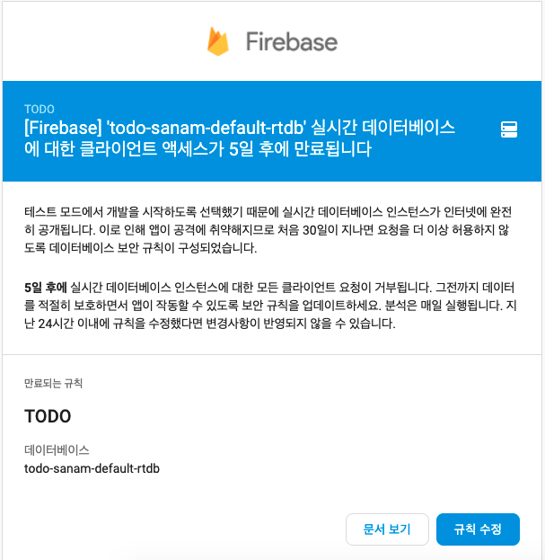

# 파이어스토어 규칙

## 규칙의 필요성

메일을 확인하던 중 아래와 같은 메일을 받게 되었다... 처음 파이어베이스 설정할 때 두 가지 선택지가 있었는데, 쉬워보이는 길을 선택했었고 그 결과로 아래와 같은 메일이 오게된 것이다.



메일이 의미하는 바를 알아보기 전에 우선 우리의 서버리스 앱에 대해 생각 해보자. 보통 웹앱에서는 프론트에서 요청을 백엔드로 보내고, 백엔드에서는 해당 요청에 대한 **권한, 유효성 검사** 를 수행하고 db 조작을 수행한다. 하지만 우리의 앱은 서버리스기 때문에 위의 역할을 해주는 백엔드단이 존재하지 않는다.

위의 메일은 **권한 검사** 에 대한 경고다. 현재 우리의 파이어스토어는 어떤 아이디로 요청을 보내든 `todo` 를 조작할 수 있다. 즉 `A` 라는 유저가 `B` 라는 유저의 `todo` 를 업데이트하고 삭제할 수 있다는 뜻이다. 물론 현재 프론트의 구조상 그런 일은 발생할 수 없지만, 포스트맨 등을 통해서 프론트을 제외한 상태에서는 그러한 요청이 **올 수도 있다.** 따라서 이런 요청에 대한 권한 검사를 해줘야한다.

## 규칙 만들기

> [공식문서를 보고 어떻게 규칙을 설정하는지 알아보자.](https://firebase.google.com/docs/rules/basics?hl=ko#cloud-firestore)

### 기존의 규칙 분석

규칙을 설정하기 전에 공식문서를 보고 어떻게 하는지 알아보자.

규칙을 만드는건 생각보다 간단하다. 우선 기본으로 어떻게 작성되어있는지 보자.

```text
rules_version = '2';
service cloud.firestore {
  match /databases/{database}/documents {
    match /{document=**} { // 1. 라우트 매치
      allow read, write: if  // 2. 조건
          request.time < timestamp.date(2021, 9, 29);
    }
  }
}
```

위의 코드를 분석해보면,

1. 모든 요청 `/{documenet=**}` 은 해당 블럭에서 권한 검사를 하게 된다.
2. 모든 요청은 수행된다. 단 조건은 현재 날짜가 9월 29일 이전일 때만이다.

우선 `날짜 조건` 을 없애고 싶다면 아래처럼 하면 된다.

| CRUD | 조건 |
| :--- | :--- |
| `create` | 유저가 로그인 되어있어야 한다. |
| `read` | 유저가 로그인 되어있어야 한다. |
| `update` |  `todo` 의 `user` 컬럼이 로그인한 `user` 와 동일해야한다. |
| `delete` |  `todo` 의 `user` 컬럼이 로그인한 `user` 와 동일해야한다. |

```text
rules_version = '2';
service cloud.firestore {
  match /databases/{database}/documents {
    match /{document=**} {
      allow read, write: if true
    }
  }
}
```

### 새롭게 만들 규칙 \(CRUD\)

#### user

`user` 에 대한 요청 권한 검사는 일단 넘어가자. 왜냐하면 현재는 `user` 의 데이터를 조작하는 일이 없기 때문

```text
rules_version = '2';
service cloud.firestore {
  match /databases/{database}/documents {
    match /users/{document} {
      allow read, write: if true
    }
  }
}
```

#### todo

| CRUD | 조건 |
| :--- | :--- |
| `create` | 유저가 로그인 되어있어야 한다. |
| `read` | 유저가 로그인 되어있어야 한다. |
| `update` |  `todo` 의 `user` 컬럼이 로그인한 `user` 와 동일해야한다. |
| `delete` |  `todo` 의 `user` 컬럼이 로그인한 `user` 와 동일해야한다. |

조건을 알아봤으니 규칙을 작성하자.

```text
rules_version = '2';
service cloud.firestore {
  match /databases/{database}/documents {
    match /users/{document} {
      allow read, write: if true
    }
    match /todos/{document} {
      allow read, write: if (condition) // 1. 유저의 로그인 검사
      allow delete, update: if (condition) // 2. 본인인지 검사
    }
  }
}
```

1. 유저의 로그인 검사
   * 로그인 검사는 너무너무 간단하다. 왜냐하면 우리는 현재 `firebase` 의 `social authenticate` 를 이용하고 있기 때문에 모든 요청에는 `auth` 에 대한 정보가 들어있다.
   * `request` 객체를 이용하자.
2. 본인인지 검사
   * `request` 로 요청보낸 유저의 `uid` 를 가져온다.
   * `resource` 객체로 접근한 `document` 의 데이터를 검사한다.

이제 코드로 작성해보자.

```text
rules_version = '2';
service cloud.firestore {
  match /databases/{database}/documents {
    match /users/{document} {
      allow read, write: if true
    }
    match /todos/{document} {
      allow read, write: if {
        return request.auth.uid != null;
      }
      allow delete, update: if {
        return resource.data.user == request.auth.uid
      }
    }
  }
}
```

