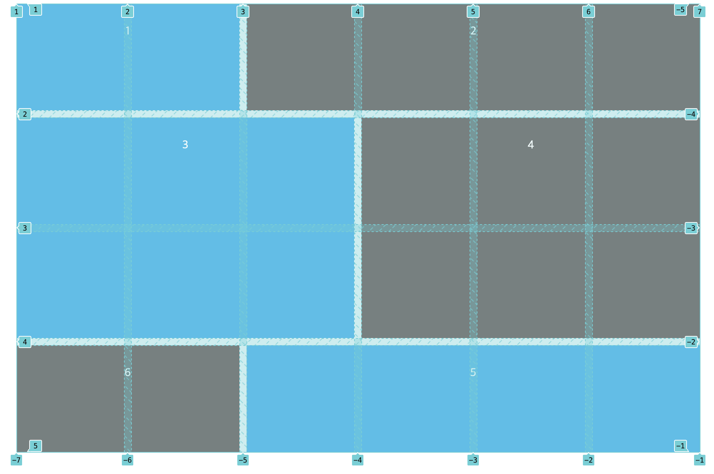

# GRID

> [LEARN GRID!](https://learncssgrid.com/)
>
> [1분코딩 이제는 GRID를 배워보자!](https://studiomeal.com/archives/533)
>
> [NET NINZA의 GRID](https://www.youtube.com/watch?v=J5GWyiWU2H8&list=PL4cUxeGkcC9itC4TxYMzFCfveyutyPOCY&index=4&ab_channel=TheNetNinja)

왜? 이제와서 그리드를 할까..? 아래 사진처럼 박스를 나열하는 경우를 생각해보자. 이렇게 나열하는 방법은 뭐... 많이 있을거다. 그중에서 하나의 `row` 컨테이너를 만들고 그 안에 `inline-box` 을 나열하는 방법이 아마 가장 쉬울거라고 생각이 되는데.... 이거 하나하나 해주는거 정말 생각만해도 끔찍하다.


하지만, 그리드를 사용하면 위와같은 레이아웃은 정말 한방에 끝나버린다... 그리드는 마법이다.

## 기타 설정

### `grid-gap`

그리드 셀 사이의 간격을 지정한다. 상하, 좌우 모두 지정한다. **단, 셀 사이의 간격만 지정할 뿐 셀이 바깥과 닿아있는 곳에는 적용되지 않는다.** 그리드를 사용할 때는 `margin` 을 사용하지 말자!!!

### `grid-row-gap`, `grid-column-gap`

그리드열, 로우 사이의 간격을 지정한다.

## COLUMNS

### `grid-template-column`

하나의 `row` 에 얼마나 많은 열을 생성할지, 그리고 각 열의 사이즈를 지정할 수 있다.

`grid-template-column: 33% 33% 33%`

`grid-template-column: 1fr 2fr 1fr`

`grid-template-columns: repeat(10, 1fr);`

`fr` 은 `fraction` 이라고 한다.

### `grid-auto-columns`

열의 수를 지정하지 않을 때는 이걸 사용하면 된다.

## ROWS

### `grid-template-rows`

`grid-template-columns: repeat(3, 1fr);`

`grid-template-rows: repeat(3, minmax(150px, auto));`

몇 개의 `row` 까지 속성을 적용할지 결정할 수 있다.

3 대신에 `auto-fill` 을 입력하면 `grid-auto-rows` 와 동일한 효과를 낼 수 있다. `grid-template-columns: repeat(auto-fill, minmax(20%, auto));`

`minmax` 는 최소, 최대를 의미한다. 따라서 `row` 의 최소는 150px 최대는 내부요소의 크기에 따른다.

### `grid-auto-rows`

`grid-template-rows` 는 큰 문제가 있었다. 우리가 그려야하는 행 의 수가 정해져있을 때는 그 `grid-template-rows` 를 사용하면 되지만 그렇지 않은 경우에는 이걸 쓰면 된다.

높이만 지정하면 된다.

`grid-auto-rows: minmax(200px, auto)`

## Grid-Lines

> 이전에 그리드를 사용하면 박스의 위치를 원하는 대로 바꿀 수 있다고 했다. 그 방법이 바로 `grid-lines` 다.



```css
#content {
  display: grid;
  grid-template-columns: repeat(6, 1fr);
  grid-template-rows: repeat(4, minmax(150px, auto));
  grid-gap: 10px;
  max-width: 960px;
  margin: 0 auto;
}
```

위의 그리드의 사이즈는 몇일까? **4 x 6 이다.** 즉 그리드 라인의 값은 `+ 1` 이 된다. 1번부터 6번 박스까지 각 박스의 위치를 `grid-lines` 를 이용해서 나타내보자

### 1번 박스

폭: 시작점은 1, 끝점은 3 열: 지정할 필요없음

```css
.one {
  grid-column: 1 / 3;
  // 아래와 동일하다.
  // grid-column-start: 1;
  // grid-colimn-end: 3;
}
```

### 2번 박스

폭: 시작점은 3, 끝점은 7 열: 지정할 필요 없음

```css
.two {
  grid-column: 3 / 7;
}
```

### 3번 박스

폭: 시작점은 1, 끝점은 4 열: 시작점은 2, 끝점은 4

```css
.three {
  grid-column: 1 / 4;
  grid-row: 2 / 4;
}
```

### 4번 박스

폭: 시작점은 4, 끝점은 7 열: 시작점은 2, 끝점은 4

```css
.four {
  grid-column: 4 / 7;
  grid-row: 2 / 4;
}
```

### 5번 박스

폭: 시작점은 1, 끝점은 3 열: 시작점은 4, 끝점은 5

```css
.five {
  grid-column: 1 / 3;
  grid-row: 4 / 5; // grid-row: 4;
}
```

### 6번 박스

폭: 시작점은 3, 끝점은 7 열: 시작점은 4, 끝점은 5

```css
.six {
  grid-column: 3 / 7;
  grid-row: 4 / 5; // grid-row: 4;
}
```

## align-self, justify-self

**그리드 셀 안에서 자기 자신을 정렬하는 명령어다.** 아래의 링크를 보면 된다.

[align-self](https://developer.mozilla.org/en-US/docs/Web/CSS/align-self)

[justfi-self](https://developer.mozilla.org/en-US/docs/Web/CSS/justify-self)

## IE!!

> [https://www.w3.org/TR/2011/WD-css3-grid-layout-20110407/](https://www.w3.org/TR/2011/WD-css3-grid-layout-20110407/)

| 표준 | IE |
| :--- | :--- |
| `display: flex` | `display: -ms-grid` |
| `grid-template-rows` | `-ms-grid-rows` |
| `grid-template-columns` | `-ms-grid-columns` |
| `grid-row-start` | `-ms-grid-row` |
| `grid-column-start` | `-ms-grid-column` |
| `grid-row: 1/ 3` === `grid-row: 1 / span 2` | `-ms-grid-row-span: 2` |
| `grid-column: 1 / 3` === `grid-column: 1 / span 2` | `-ms-grid-column-span:2` |
| `align-self` | `-ms-grid-row-align` |
| `justify-self` | `-ms-grid-column-align` |


