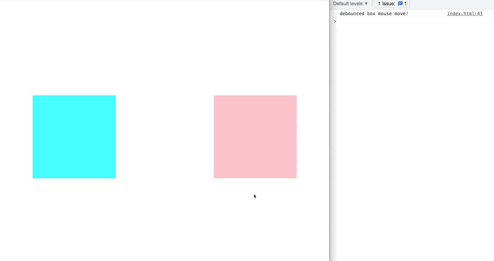

# 디바운싱과 쓰로틀링


[로대쉬](https://lodash.com/)


## 쓰로틀링과 디바운싱

본래 쓰로틀링이란 주로 모바일 기기에서 많이 사용되는 용어다. 성능을 위한 오버클럭이 디바이스에 무리를 주는 것을 방지하기 위해 고의로 성능을 낮추는 조절 방식을 의미함. 즉, 쓰로틀링을 사용하면 고의로 성능을 낮추고 디바이스에 안정을 줄 수 있게 된다. 그렇가면 왜 주로 모바일 기기에서 사용하면서 게다가 고의로 성능을 낮추는 쓰로틀링의 개념을 웹프론트엔드에서 알아야하는가?

## 웹 프론트엔드에서 디바운스와 쓰로틀은 필요한가?

쓰로틀링은 고의로 성능을 낮춘다. 낮춤으로써 모바일 기기의 안정을 추구한다. 웹프론트엔드에서도 마찬가지다. 쓰로틀링을 사용함으로써 **100번 실행해야할 함수를 1번 실행함으로써 안정적인 프론트엔드를 구성할 수 있게 된다.**

### 자 그러면 여기서 의문점. 100번 실행해햐 할 함수를 1번 실행하는건 안좋은거 아니야?

물론 100번 모두 반드시 실행해야하는 함수가 있을 수 있다. 하지만 그렇지 않은 경우라면? 또는 함수 한번의 실행이 매우 무거워서, 100번을 실행하게 되면 문제가 생기는 경우라면? 즉, 어떤 경우에서는 매번 함수를 실행하는 형태보다 **가끔 한번 실행하는게 더 좋을때도 있게 되는 법이다.**

## 디바운싱과 쓰로틀링의 정의를 알아보자

> 디바운싱이란 **연이어 호출되는 함수들 중 일정 시간 동안 함수가 들어오지 않으면 마지막 함수를 실행하는 것**
>
> 쓰로틀링이란 **마지막 함수가 호출된 후 일정 시간이 지나기 전까지는 다시 호출하지 않는 것. 일정 시간 후에는 함수를 다시 호출할 수 있게 된다.**

정의만을 보면 디바운싱과 쓰로틀링에 대해 이해하기가 어려울 수 있다. [여기 링크에 들어가서 대략적으로 감을 잡아보자.](http://demo.nimius.net/debounce_throttle/) 해당 링크에서는 **mouse move 이벤트마다 일반적인 경우, 디바운싱, 쓰로틀링처리를 한 경우 함수가 어떻게 호출되는지 보여준다.**


위 `gif` 를 보면 어느정도 감이 잡힌다.

**쓰로틀링은 이벤트가 수많이 발생하면 콜백함수를 일정시간마다 가장 최근에 사용된 함수를 실행한다.**

**디바운싱은 마우스가 움직이고 있을 때는 콜백함수를 실행하지 않는다. 마우스가 일정시간 이상 움직임이 없으면 함수를 호출한다.**

## 그래서, 디바운싱과 쓰로틀링을 어떻게 사용해?

> 간단하게 [로대쉬](https://lodash.com/)를 이용하자

### 쓰로틀

> throttled function that only invokes `func` at most once per every `wait` milliseconds.

[로대쉬 쓰로틀](https://lodash.com/docs/4.17.15#throttle) 을 읽어보자. 해당 문서를 보면 쓰로틀이 무엇이고 어떻게 사용하면 되는지 자세히 나와있다. 예시를 들어보고 직접 사용해보자.

1. `mousemove` 이벤트가 등록된 박스가 있다.
2. 해당 박스에 올라가면 `console.log` 가 출력되야한다.
3. 단, 모든 `mousemove` 이벤트마다 `console.log` 가 출력될 필요는 없다. 일정 시간마다 한번만 출력되게 만들자.

이런 요구 사항이 있을 때 아래와 같은 코드를 작성하고, 출력을 얻을 수 있게 된다.

```javascript
 const throttledBox = document.querySelector('.throttled-box');
 const throttledFunc = _.throttle(() => console.log('throttled box mouse move!'), 1000);
 throttledBox.addEventListener('mousemove', throttledFunc);
```

#### 직접 구현

```javascript
const throttle = (fn, wait) => {
  let timeId = null;
  return (...args) => {
    if (!timeId) {
      timeId = setTimeout(() => {
        fn(...args);
        timeId = null;
      }, wait);
    }
  };
};
```

### 디바운스

> debounced function that delays invoking `func` until after `wait` milliseconds have elapsed since the last time the debounced function was invoked.

[로대쉬 디바운스](https://lodash.com/docs/4.17.15#debounce) 를 읽어보자. 개인적으로 인터넷에 있는 디바운스 글 보다 로대쉬 문서의 짧은 설명이 더 이해하기 쉬웠다.ㅎㅎ... 아래의 요구사항을 디바운스를 이용해 구현하자.

1. `mousemove` 이벤트가 등록된 박스가 있다.
2. 해당 박스에 올라가면 `console.log` 가 출력되야한다.
3. 단, 모든 `mousemove` 이벤트마다 `console.log` 가 출력될 필요는 없다. **일정 시간 이상 마우스의 움직임이 감지되지 않는다면, 콘솔로그를 출력하자.**

```javascript
const debouncedBox = document.querySelector('.debounced-box');
const debouncedFunc = _.debounce(() => console.log('debounced box mouse move!'), 1000);
debouncedBox.addEventListener('mousemove', debouncedFunc);
```

#### 직접 구현

```javascript
const debounce = (fn, millesecond) => {
  let timeId = null;
  return (...args) => {
    if (timeId) clearTimeout(timeId);
    timeId = setTimeout(() => {
      fn(...args);
      timeId = null;
    }, millesecond);
  };
};
```

### 결과




## 잡소리..

처음 웹프로젝트를 시작한지 거의 반년이 된 시점에 디바운스, 쓰로틀의 개념을 다시보게 되었다. 그 당시에 이 개념을 읽고 적용하려고 했을 때는 정말 막막했다. 개념을 봐도 이해가 가지 않았고 로대쉬, 언더스코어같은 라이브러리를 사용해도 적용에 엄청 헤맸었다.

지금보니 너무 쉬운 개념이었고 또 사용하기도 너무 쉬웠다. 같이 공부한 사람들 모두 제 갈길을 잘 가고 있는데 나만 허송세월하는건 아닌지... 걱정이 많았지만 나름 레벨업을 많이했구나.. 라는 생각이 든다. 반년 뒤에는 얼마나 성장해있을지 내 자신이 기대된다.

cjdmadm

