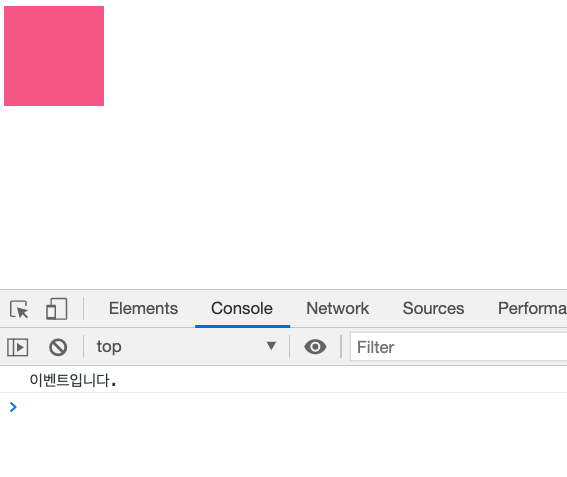
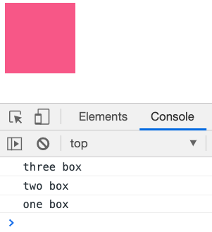
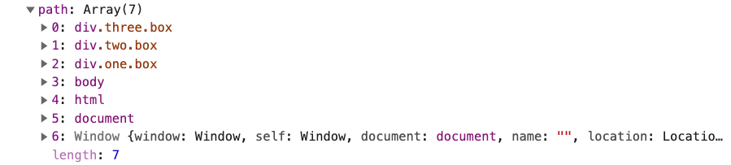

# 이벤트 위임


\*\*\*\*[**모던 자바스크립트 듀토리얼**](https://ko.javascript.info/bubbling-and-capturing)\*\*\*\*


## 이벤트 위임

> 문제의 시작은 리스트로 된 요소에 이벤트를 거는 곳에서 시작됐다....

## HTML 요소에 이벤트 걸기

일반적인 HTML 요소에 이벤트를 거는 방법은... 처음 배우는 사람도 금방 할 수 있을 만큼 쉽다.

네모난 박스를 누르면 `console.log` 를 하는 html과 이벤트를 만들어보자.

```markup
<!DOCTYPE html>
<html lang="en">

<head>
  <meta charset="UTF-8">
  <title>기본</title>
  <style>
    #box {
      width: 100px;
      height: 100px;
      background: #f06292;
    }
  </style>
</head>

<body>
  <div id="box"></div>
  <script>
    document.querySelector("#box").addEventListener("click", function () {
      alert("이벤트입니다.");
    });
  </script>
</body>

</html>
```

위와 같은 코드를 실행하면 아래와 같이 출력되는걸 확인할 수 있다.



## 겹쳐져있는 요소에 이벤트 걸기

```markup
<!DOCTYPE html>
<html lang="en">

<head>
  <meta charset="UTF-8">
  <title>자바스크립트 이벤트</title>
  <style>
    .box {
      width: 100px;
      height: 100px;
      background: #f06292;
    }
  </style>
</head>

<body>
  <div class="one box">
    <div class="two box">
      <div class="three box">
      </div>
    </div>
  </div>
  <script>


    var boxs = document.querySelectorAll('.box');
    boxs.forEach(function (box) {
      box.addEventListener('click', logEvent);
    });

    function logEvent(event) {
      console.log(event.currentTarget.className);
    }
  </script>
</body>

</html
```

위 코드를 보면 **3개의 div요소가 겹쳐져 있다.** 그리고 **querySelectorAll** 을 통해서 모든 **box 클래스를 갖는 div 를 찾고 이벤트를 건다.** 클릭해보기전에 예측을 해보자면 겹쳐있다고는 해도 실제 사용자에게 보여지는 요소는 마지막 3번째 요소이므로 **three box** 하나가 출력되었을거같다.

자, 이제 브라우저에서 요소를 클릭해보자.



**오잉... 무슨 일이지 대체 왜 3개 모두 찍힌거야?**

### event bubbling

콘솔로그로 출력된 걸 보면 가장 마지막 요소부터 처음요소까지 위로 올라오면서 동작이 됐다는걸 알 수 있다. **이벤트 버블링이란 한 요소에 이벤트가 발생하면, 이 요소에 할당된 핸들러가 동작하고 이어서 부모 요소의 핸들러가 동작한다는 것이다. 그리고 가장 최상단의 조상 요소를 만나기 전까지 이 과정이 반복되는 과정을 말한다.**

따라서 네모 박스를 클릭했을 때 아래와 같은 동작이 수행된다.

1. 가장 안쪽의 div에서 클릭이벤트가 발생
2. 바깥의 div에서 클릭이벤트가 발생
3. 그 바깥으 이벤트 핸들러가 동작....
4. document 객체를 만날 때 까지 이벤트 핸들러가 동작한다.

**logEvent** 를 약간 수정해서 **event** 자체를 출력해보자.



**console.log\(event\)** 에서 **path** 를 보면 이렇게 되어있다. 클릭이벤트가 **three box** 부터 끝까지 타고 올라가는걸 확인할 수 있다.

### 이벤트 캡쳐링

버블링과는 반대로 **상위에서 하위로 뻗어 나간다.** 위의 예제에서 `capture: true` 라는 옵션만 주면 확인할 수 있다.

캡쳐링은 클릭 이벤트가 발생한 지점을 찾아내려가는 이미지를 상상하면 된다.

## stopPropagation

이렇게 이벤트가 위로 올라가고.... 아래로 내려가는데 보통의 경우 이는 개발자가 원하지 않는 상황이다. 이 문제으 해결방법은 코드를 구조적으로 짜는게 가장 좋겠지만, 어쩔 수 없는 경우에는 그 자리에서 즉각적으로 버블링과 캡쳐링을 막아야만 한다. 이 때 사용하는 문법이 **stopPropagation** 이다.

## 이벤트 위임

이벤트 위임이란 **하위 요소에 각각 이벤트를 붙이지 않고 상위 요소에서 하위 요소의 이벤트들을 제어하는 방식**이다.

```markup
<!DOCTYPE html>
<html lang="en">

<head>
  <meta charset="UTF-8">
  <title> no event delegation</title>
</head>

<body>
  <h1>오늘의 할 일</h1>
  <ul class="itemList">
    <li>
      <input type="checkbox" id="item1">
      <label for="item1">이벤트 버블링 학습</label>
    </li>
    <li>
      <input type="checkbox" id="item2">
      <label for="item2">이벤트 캡쳐 학습</label>
    </li>
  </ul>

  <script>

    var inputs = document.querySelectorAll('input');
    inputs.forEach(function (input) {
      input.addEventListener('click', function (event) {
        alert('clicked');
      });
    });

  </script>
</body>

</html
```

위의 코드는 쿼리 셀렉터를 통해서 모든 input box 를 찾고 각 요소에 클릭 이벤트 리스너를 추가하는 예제다. 눈으로 봐도 문제가 없고 실제로 실행해도 문제가 없다.

**하지만 이 코드는 문제가 있다.** 만약 새로운 할일 목록을 추가할 때 마다 이벤트 리스너를 달아줘야 하기 때문. 즉 동적인 프로그래밍이 불가능해지는 코드를 만드는 행위다.

자바스크립트 코드만 아래처럼 바꿔보자.

```javascript
var itemList = document.querySelector('.itemList');
itemList.addEventListener('click', function(event) {
    alert('clicked');
});
```

이렇게 되면 이벤트 위임의 정의대로 상위 요소 하나에 이벤트를 등록했을 뿐인데 그 하위요소에서는 해당 이벤트를 리슨할 수 있게 된다. 심지어 동적으로 추가된 요소들도 자동으로 이벤트를 듣게된다!

