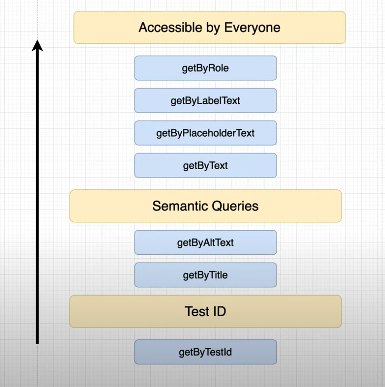

# react-testing-library



## 테스트의 종류

1. unit test
2. integration test
3. E2e test

여기서 말하는 unit test 는 하나의 컴포넌트를 대상으로 하는 테스트라고 생각하면 된다.

integration test 는 여러 컴포넌트의 인터렉션을 통해 하는 테스트를 의미한다.

e2e 테스트는 시뮬레이션의 느낌

## react-testing-library

테스트를 위해 `test` 블록에서 해야하는 것들

1. 테스트를 위한 컴포넌트를 렌더링한다.
2. 렌더링 된 컴포넌트왕 상호작용하기 위한 요소를 찾는다.
3. 인터렉팅을 한다. \(원인을 만든다\)
4. 3번의 결과를 테스팅한다. \(Assert\)

### screen 객체를 이용해 렌더링 된 요소에 접근하자

screen 객체를 이용하면 렌더링 된 화면에 직접적으로 접근할 수 있게 된다.

이렇게 접근해서 테스트 원하는 요소를 불러온 뒤 작업을 하면 됨. Screen 에는 요소를 선택하는 많은 함수가 있는데 아래의 규칙을 따른다. 대부분의 경우에는 `get` 을 이용한다. 만약 비동기를 사용해야한다면 `find` 를 사용하자.


#### priority



### 테스트를 시작하자

컴포넌트를 테스트할 때는 일반적으로 `__test__` 라는 이름을 갖는 폴더를 각 컴포넌트에 만들어준다. 그리고 해당 폴더에서 테스트 파일을 만든다.


테스트 파일은 아래처럼 작성하면 된다. 아래의 예시는 `get~, find~, query~,` 등의 `screen` 의 메서드를 이용해 요소를 잡아온다. 주목할건 `test-id` 를 이용해 잡아오는 예시. 이 예시가 자주 사용되는지는 모르겠지만 확실히 유용하다는걸 알겠다.

```javascript
import { render, screen } from '@testing-library/react';
import Header from '../Header';

it('should render same text passed into title prop', async () => {
  render(<Header title='My Header' />);
  const headeringElement = screen.getByText(/My header/i);
  expect(headeringElement).toBeInTheDocument();
});

it('same text passed into title prop', async () => {
  render(<Header title='My Header' />);
  // NOTE: 두 번째 {} 는 옵션이다. heading 에 해당하는 2개의 요소가 찾아져서 원래는 실패해야하는데
  // NOTE: 조건으로 My Header를 갖는 헤딩만 찾고 하나만 선택되서 실패하지 않는다.
  const headeringElement = screen.getByRole('heading', { name: 'My Header' });
  expect(headeringElement).toBeInTheDocument();
});

it('getBy TestId', () => {
  render(<Header title='My Header' />);
  const headerElement = screen.getByTestId('header-1');
  expect(headerElement).toBeInTheDocument();
});

// NOTE: findBy 를 사용하기 위해서는 await 를 사용해야만한다.
it('findBy TestId', async () => {
  render(<Header title='My Header' />);
  const headerElement = await screen.findByTestId('header-1');
  expect(headerElement).toBeInTheDocument();
});

// NOTE: 존재하지 않는걸 테스트 할 때 사용하는 경우가 많음
it('queryBy TestId', async () => {
  render(<Header title='My Header' />);
  const headerElement = await screen.queryByText(/dogs/i);
  expect(headerElement).not.toBeInTheDocument();
});

// NOTE: getAllBy
// NOTE: 그 결과가 array가 된다.
it('getAllNy', async () => {
  render(<Header title='My Header' />);
  const headerElement = screen.getAllByRole('heading');
  expect(headerElement.length).toBe(2);
});
```

### react-router-dom 과 같이 사용할 때 에러


테스트를 작성할 때 아주 기본적인 테스트인데도 이렇게 에러가 나는 경우가 있다. 왜 그럴까?

이유는 위의 에러에 잘 나와있다. `Link` 컴포넌트는 `react-router-dom` 에서 제공하고 해당 컴포넌트를 사용하기 위해서는 `Router` 의 하위에서만 사용할 수 있는데 우리는 `TodoFooter` 라는 컴포넌트를 `isolation` 하기 위해 밖으로 뺴서 사용하기 떄문이다 .즉 `Router` 의 하위에서 `TodoFooter` 를 테스트하고 있지 않기 때문이다.

```javascript
import React from 'react'
import "./TodoFooter.css"
import { Link } from "react-router-dom"

function TodoFooter({
    numberOfIncompleteTasks
}) {
    return (
        <div className="todo-footer">
            <p>{numberOfIncompleteTasks} {numberOfIncompleteTasks === 1 ? "task" : "tasks"} left</p>
            <Link to="/followers">Followers</Link>
        </div>
    )
}

export default TodoFooter
```

`TodoFooter` 의 코드. 내부에서 `Link` 를 사용하고 있는걸 알 수 있다.

이제 해결 방법에 대한 실마리는 나왔다. `TodoFooter` 를 `Router` 의 하위 컴포넌트로 만든 다음에 테스트를 하면 된다!!

#### 해결 방법

`TodoFooter.test.js` 을 아래처럼 만들어주면 된다.

```javascript
import { render, screen } from '@testing-library/react';
import TodoFooter from '../TodoFooter';
import { BrowserRouter } from 'react-router-dom';

const MockTodoFooter = ({ numberOfIncompleteTasks }) => (
  <BrowserRouter>
    <TodoFooter numberOfIncompleteTasks={numberOfIncompleteTasks} />
  </BrowserRouter>
);

it('should render the correct amount of incomplete tasks', async () => {
  render(<MockTodoFooter numberOfIncompleteTasks={5} />);
  const paragraphElement = screen.getByText(/5 tasks left/i);
  expect(paragraphElement).toBeInTheDocument();
});
```

`react-router-dom` 에서 `Router` 를 가져와 주고 임시로 컴포넌트를 만들면 끝

### assertion 을 자세히 알아보자

```javascript
it('should render the correct singluar syntax when the amount is 1', async () => {
  render(<MockTodoFooter numberOfIncompleteTasks={1} />);
  const paragraphElement = screen.getByText(/1 task left/i);
  expect(paragraphElement).toBeInTheDocument();
  expect(paragraphElement).toBeTruthy();
  expect(paragraphElement).toBeVisible();
  expect(paragraphElement).toBeInTheDocument();
  expect(paragraphElement.textContent).toBe('2 tasks left');
});
```

Assertion 의 종류는 굉장히 많다!

### event Fire!!!

[https://testing-library.com/docs/guide-events/](https://testing-library.com/docs/guide-events/)

이벤트를 고의로 만들어보자

`*import* { render, screen, fireEvent } *from* '@testing-library/react';` 처럼 `fireEvent` 를 추가로 import 해오자.

```javascript
it('should be abel to type in input', async () => {
  render(<AddInput todos={[]} setTodos={mockedSetTodo} />);
  const element = screen.getByPlaceholderText(/Add a new task here.../i);
  // NOTE: trigger event
  fireEvent.change(element, { target: { value: 'Go Grocery Shopping' } });
  expect(element.value).toBe('Go Grocery Shopping');
});
it('should have empty input when add button is clicked', async () => {
  render(<AddInput todos={[]} setTodos={mockedSetTodo} />);
  const InputElement = screen.getByPlaceholderText(/Add a new task here.../i);
  const buttonElement = screen.getByRole('button', { name: /Add/ });
  // NOTE: trigger event
  fireEvent.change(InputElement, {
    target: { value: 'Go Grocery Shopping' },
  });
  fireEvent.click(buttonElement);
  expect(InputElement.value).toBe('');
});
```

### Integration testing!

> addInput 에 입력을 하고..... 버튼 이벤트를 발생시키면 `TodoList` 컴포넌트에 추가한 `Todo` 가 생기는지를 테스트하고싶다. 즉, 하나의 컴포넌트만이 아니라 해당 컴포넌트의 이벤트로 인해 다른 컴포넌트와 상호작용하는걸 테스트

아주 간단하다. `fireEvent` 를 통해 이벤트를 발동한다음 `get, ..` 등의 셀렉터를 통해 특정 요소를 잡아오면 된다! \(특정 컴포넌트만을 `render` 해도 `getBy..` 등의 셀렉터로 다른 컴포넌트의 `html` 을 잡아올 수 있음\)

아래는 예시다.

```javascript
const MockTodo = ({ numberOfIncompleteTasks }) => (
  <BrowserRouter>
    <Todo />
  </BrowserRouter>
);

const addTasks = (tasks) => {
  const inputElement = screen.getByPlaceholderText(/Add a new task here.../i);
  const buttonElement = screen.getByRole('button', { name: /Add/i });
  tasks.forEach((task) => {
    fireEvent.change(inputElement, { target: { value: task } });
    fireEvent.click(buttonElement);
  });
};

describe('Todo', () => {
  it('tasks should not have completed class when intially rendered', async () => {
    render(<MockTodo />);
    const tasks = ['test1'];
    addTasks(tasks);

    const divElement = screen.getByText('test1');
    expect(divElement).not.toHaveClass('todo-item-active');
  });

  it('tasks should have completed class when clicked', async () => {
    render(<MockTodo />);
    const tasks = ['test1'];
    addTasks(tasks);

    const divElement = screen.getByText('test1');
    fireEvent.click(divElement);
    expect(divElement).toHaveClass('todo-item-active');
  });
});
```

코드를 보면 `todo` 를 추가한 다음, 렌더 된 컴포넌트 밖의 요소를 `get..` 으로 잡아오고 해당 요소의 값들을 테스트하는걸 확인할 수 있다.

이렇게 `integration` 테스트를 하면된다!

### async-findBy

`FollowerList` 컴포넌트를 보면, `list` 의 요소들은 `useEffect` 를 사용해서 컴포넌트가 장착 된 다음에 비동기로 가져와진다. 아래는 코드다.

```javascript
export default function FollowersList() {
  const [followers, setFollowers] = useState([]);

  useEffect(() => {
    fetchFollowers();
  }, []);

  const fetchFollowers = async () => {
    const { data } = await axios.get('https://randomuser.me/api/?results=5');
    setFollowers(data.results);
  };
...
```

이렇게 `Followers` 를 세팅한 다음 이 값들을 이용해 렌더링 한 요소를 가져와 보자.

```javascript
describe('FollowersList', () => {
  it('should render FollowerList Element', async () => {
    render(<MockFollowerList />);
    const followerDivElement = screen.getByTestId('follower-item-0');
    expect(followerDivElement).toBeInTheDocument();
  });
});
```

안타깝게도 에러가 발생한다...


그렇다면 왜 에러가 발생할까?

이유는 간단하다. 컴포넌트가 렌더링 되고 난 이후에 `useEffect` 를 실행해서 비동기로 데이터를 가져오고, 세팅해야하는데 우리의 테스트는 이런 비동기를 기다리기 전에 바로 테스트를 해버리는것. 따라서 발견하지 못하고 에러가 발생한다.

이런 경우 사용할 수 있는 명령어를 이전에 학습하긴 했다. 바로 `find` 를 사용하는 것.

아래는 수정된 코드다.

```javascript
describe('FollowersList', () => {
  it('should render FollowerList Element', async () => {
    render(<MockFollowerList />);
    const followerDivElement = await screen.findByTestId('follower-item-0');
    expect(followerDivElement).toBeInTheDocument();
  });
});
```

`async` 와 `await` 키워드에도 주목하자.

### async 로 데이터 가져오지 말고 Mocking 하자

API 를 그냥 사용하면서 테스트 하면 3가지 문제점이있다.

1. Request 비용이 크다
2. 느리다
3. 테스트가 외부요인에 의존하게 된다.

따라서 테스트에서 사용하는 API 는 isolation 하게 만들어야한다. 바로 Mocking 하는것. 간단히 더미데이터를 보내준다고 생각하면된다.

모킹하는 순서는 아래와 같다.

1. 우선 `src` 폴더에 `__mocks__` 이름을 갖는 폴더를 만들어주자.
   * 폴더의 이름 규칙은 매우 중요하다!!
2. 비동기 처리 코드를 파일 이름으로 그대로 사용하자.
   * 예를 들면 `axios` 로 비동기 처리를 하면 `axios.js` 파일을 만들어준다.
3. export default 할 객체를 만든다.
4. 아래처럼 코딩해주자

```javascript
const mockResponse = {
  data: {
    results: [
      {
        name: {
          first: 'Laith',
          last: 'Harb',
        },
        picture: {
          large: 'https://randomuser.me/api/portraits/men/1.jpg',
          medium: 'https://randomuser.me/api/portraits/med/men/1.jpg',
          thumbnail: '"https://randomuser.me/api/portraits/thumb/men/1.jpg"',
        },
        login: {
          username: 'ThePhonyGOAT',
        },
      },
    ],
  },
};

const axios = {
  get: jest.fn().mockResolvedValue(mockResponse),
};

export default axios;
```

`jest.fn().mockResolvedValue` 안에 원하는 데이터를 넣으면 된다.

참고로 파일 구조는 아래와같다.


그리고 하나 더 해줘야할 것이, `mock` 리셋을 매번해줘야한다. 해주지 않으면 에러가 발생. 아직 원인은 잘 모르겠다.

`package.json`에 아래를 추가해주자.

```javascript
...
  "jest": {
    "collectCoverageFrom": [
      "src/**/*.{js,jsx,ts,tsx}"
    ],
    "resetMocks": false
  }
```

