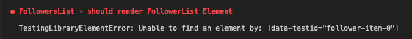

# async하게 렌더링 되는 요소 잡기

`FollowerList` 컴포넌트를 보면, `list` 의 요소들은 `useEffect` 를 사용해서 컴포넌트가 장착 된 다음에 비동기로 가져와진다. 아래는 코드다.

```javascript
export default function FollowersList() {
  const [followers, setFollowers] = useState([]);

  useEffect(() => {
    fetchFollowers();
  }, []);

  const fetchFollowers = async () => {
    const { data } = await axios.get('https://randomuser.me/api/?results=5');
    setFollowers(data.results);
  };
...
```

이렇게 `Followers` 를 세팅한 다음 이 값들을 이용해 렌더링 한 요소를 가져와 보자.

```javascript
describe('FollowersList', () => {
  it('should render FollowerList Element', async () => {
    render(<MockFollowerList />);
    const followerDivElement = screen.getByTestId('follower-item-0');
    expect(followerDivElement).toBeInTheDocument();
  });
});
```

안타깝게도 에러가 발생한다...



그렇다면 왜 에러가 발생할까? 이유는 간단하다. 컴포넌트가 렌더링 되고 난 이후에 `useEffect` 를 실행해서 비동기로 데이터를 가져오고, 세팅해야하는데 우리의 테스트는 이런 비동기를 기다리기 전에 바로 테스트를 해버리는것. 따라서 발견하지 못하고 에러가 발생한다. 이런 경우 사용할 수 있는 명령어를 이전에 학습하긴 했다. 바로 `find` 를 사용하는 것.

아래는 수정된 코드다.

## 해결

```javascript
describe('FollowersList', () => {
  it('should render FollowerList Element', async () => {
    render(<MockFollowerList />);
    const followerDivElement = await screen.findByTestId('follower-item-0');
    expect(followerDivElement).toBeInTheDocument();
  });
});
```

`findBy...` 선택자를 사용해주자~

