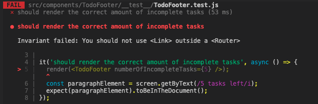

# react-router-dom 에서의 에러

## 문제



테스트를 작성할 때 아주 기본적인 테스트인데도 이렇게 에러가 나는 경우가 있다. 왜 그럴까? 이유는 위의 에러에 잘 나와있다. `Link` 컴포넌트는 `react-router-dom` 에서 제공하고 해당 컴포넌트를 사용하기 위해서는 `Router` 의 하위에서만 사용할 수 있는데 우리는 `TodoFooter` 라는 컴포넌트를 `isolation` 하기 위해 밖으로 빼서 사용하기 때문이다 .즉 `Router` 의 하위에서 `TodoFooter` 를 테스트하고 있지 않기 때문이다.

```javascript
import React from 'react'
import "./TodoFooter.css"
import { Link } from "react-router-dom"

function TodoFooter({
    numberOfIncompleteTasks
}) {
    return (
        <div className="todo-footer">
            <p>{numberOfIncompleteTasks} {numberOfIncompleteTasks === 1 ? "task" : "tasks"} left</p>
            <Link to="/followers">Followers</Link>
        </div>
    )
}

export default TodoFooter
```

## 해결

`TodoFooter` 를 `Router` 의 하위 컴포넌트로 만든 다음에 테스트를 하면 된다!! 아래처럼 코드를 수정해주자.

```javascript
import { render, screen } from '@testing-library/react';
import TodoFooter from '../TodoFooter';
import { BrowserRouter } from 'react-router-dom';

const MockTodoFooter = ({ numberOfIncompleteTasks }) => (
  <BrowserRouter>
    <TodoFooter numberOfIncompleteTasks={numberOfIncompleteTasks} />
  </BrowserRouter>
);

it('should render the correct amount of incomplete tasks', async () => {
  render(<MockTodoFooter numberOfIncompleteTasks={5} />);
  const paragraphElement = screen.getByText(/5 tasks left/i);
  expect(paragraphElement).toBeInTheDocument();
});
```

