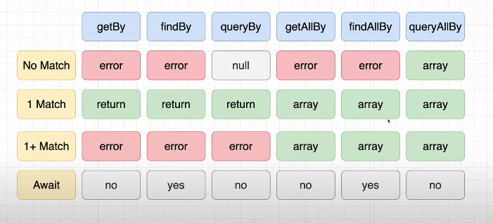

# 기본

## 테스트의 종류

1. unit test
2. integration test
3. E2e test

여기서 말하는 unit test 는 하나의 컴포넌트를 대상으로 하는 테스트라고 생각하면 된다. integration test 는 여러 컴포넌트의 인터렉션을 통해 하는 테스트를 의미한다.

e2e 테스트는 시뮬레이션이라고 생각하면 된다. 주로 `cypress` 를 이용한다.



## screen 객체를 이용해 렌더링 된 요소에 접근하자

screen 객체를 이용하면 렌더링 된 화면에 직접적으로 접근할 수 있게 된다.

이렇게 접근해서 테스트 원하는 요소를 불러온 뒤 작업을 하면 됨. Screen 에는 요소를 선택하는 많은 함수가 있는데 아래의 규칙을 따른다. 대부분의 경우에는 `get` 을 이용한다. 만약 비동기를 사용해야한다면 `find` 를 사용하자.



## 테스트를 시작하자

컴포넌트를 테스트할 때는 일반적으로 `__test__` 라는 이름을 갖는 폴더를 각 컴포넌트에 만들어준다. 그리고 해당 폴더에서 테스트 파일을 만든다.


테스트 파일은 아래처럼 작성하면 된다. 아래의 예시는 `get~, find~, query~,` 등의 `screen` 의 메서드를 이용해 요소를 잡아온다. 주목할건 `test-id` 를 이용해 잡아오는 예시.

```javascript
import { render, screen } from '@testing-library/react';
import Header from '../Header';

it('should render same text passed into title prop', async () => {
  render(<Header title='My Header' />);
  const headeringElement = screen.getByText(/My header/i);
  expect(headeringElement).toBeInTheDocument();
});

it('same text passed into title prop', async () => {
  render(<Header title='My Header' />);
  // NOTE: 두 번째 {} 는 옵션이다. heading 에 해당하는 2개의 요소가 찾아져서 원래는 실패해야하는데
  // NOTE: 조건으로 My Header를 갖는 헤딩만 찾고 하나만 선택되서 실패하지 않는다.
  const headeringElement = screen.getByRole('heading', { name: 'My Header' });
  expect(headeringElement).toBeInTheDocument();
});

it('getBy TestId', () => {
  render(<Header title='My Header' />);
  const headerElement = screen.getByTestId('header-1');
  expect(headerElement).toBeInTheDocument();
});

// NOTE: findBy 를 사용하기 위해서는 await 를 사용해야만한다.
it('findBy TestId', async () => {
  render(<Header title='My Header' />);
  const headerElement = await screen.findByTestId('header-1');
  expect(headerElement).toBeInTheDocument();
});

// NOTE: 존재하지 않는걸 테스트 할 때 사용하는 경우가 많음
it('queryBy TestId', async () => {
  render(<Header title='My Header' />);
  const headerElement = await screen.queryByText(/dogs/i);
  expect(headerElement).not.toBeInTheDocument();
});

// NOTE: getAllBy
// NOTE: 그 결과가 array가 된다.
it('getAllNy', async () => {
  render(<Header title='My Header' />);
  const headerElement = screen.getAllByRole('heading');
  expect(headerElement.length).toBe(2);
});
```


