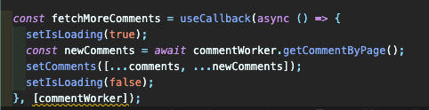

# useEffect내에서 state의 dependency 문제



## useEffect 내에서 setState 시 디펜던시 문제

### 문제

사진을 보면 디펜던시 문제로 워닝이 발생한다. 이에대한 힌트를 보면 아래와같다.

힌트에 해결방법까지 잘 나와있다.

## 해결

해결방법은 `setComments` 에 `arrow-function` 을 넣으면 된다.

### 문제의 원인

문제의 원인은 간단하다. 문제의 사진에서는 `useEffect` 의 콜백 안에서 `comments` 를 사용한다. 즉 `useEffect` 내부에서 `state` 을 사용하고 있는 것이었다. 이 말은 즉슨 `useEffect` 는 `comments` 에 `dependency` 가 있다고 생각하게 된다는 것이다.

### 문제의 해결

따라서 우리가 할 것은 **`useEffect` 에서 `state` 를 직접사용하지 않는 것이다.**  해결된 코드처럼 `setComments((comments) => [...comments, ...newComments])` 를 하게 될 경우 여기서 사용되는 `comments` 는 `setXXX` 에서 자동으로 `beforeState` 으로 세팅된다. 이렇게 **직접 사용하지 않고 함수의 인자로 beforeComments 를 사용함으로써 의존성 배열에서 제거할 수 있게 되었다.**

