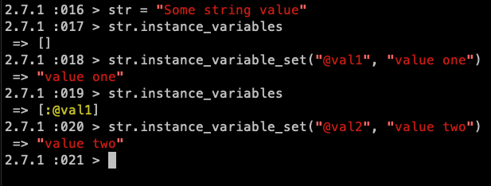
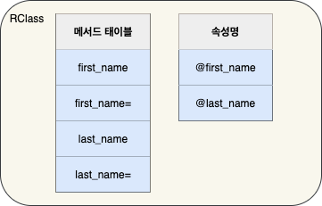
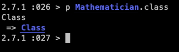
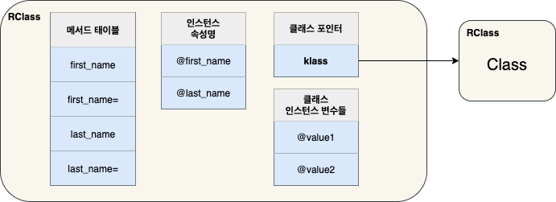
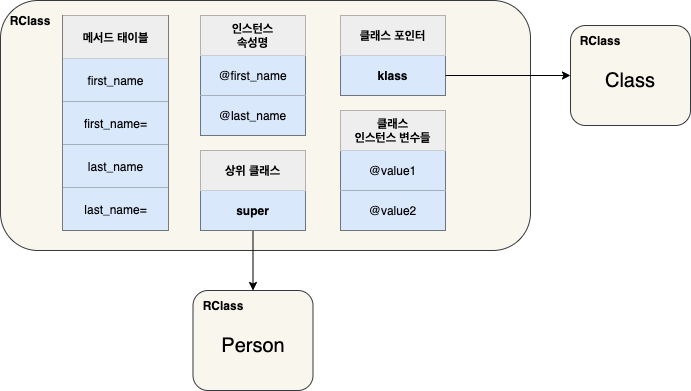
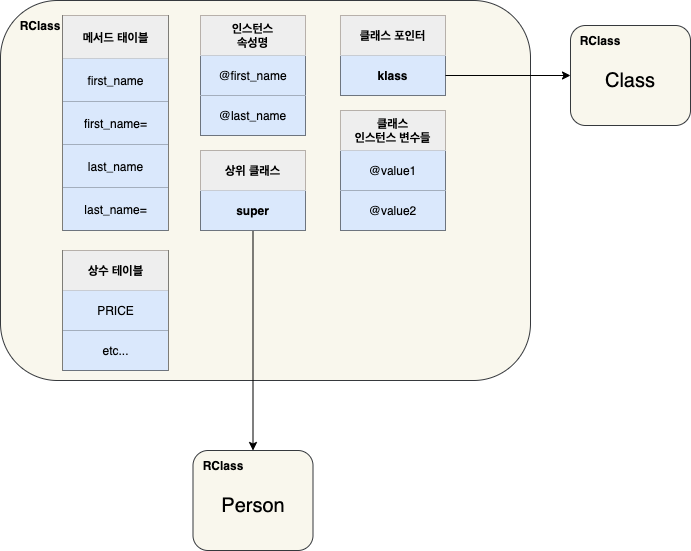
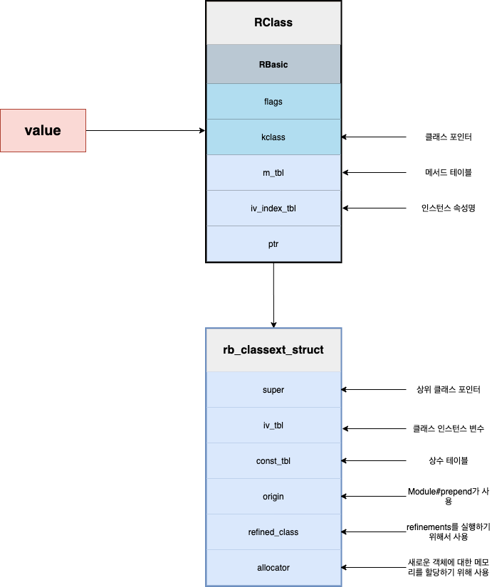

# 루비 객체와 클래스

## 객체와 클래스

> 모든 루비 객체는 클래스 포인터와 인스턴스 변수 배열의 조합이다.

* 모든 루비 프로그램은 일련의 객체들과 이들 객체 간에 전달되는 메시지로 구성된다.
* 그렇다면 루비 객체란 무엇인가? 하나의 객체는 어떤 정보를 가지는가? 현미경을 ㅌㅇ해서 하나의 루비 객체를 들여다 본다면 무엇을 알게 될까? 루비 클래스는 또 무엇인가? 등의 물음을 여기서 해결해보자

## 루비 객체의 내부 구조

* 루비는 작성한 객체를 `RObject`라는 `C 구조체`에 저장한다. 
* 그림의 상단에는 `Robject` 구조체에 대한 포인터가 위치한다. **내부적으로 루비는 항상 VALUE 포인터로 값을 참조한다.**
* `RObject` 는 `RBasic 구조체` 와 `객체 전용 정보`를 포함하고 있다.
* `RBasic`은 다양한 내부 값을 저장하는 `flags` 라는 불리언 값들과 _**klass**_ 라는 하나의 클래스 포인터를 포함한다.
  * _**클래스 포인터\(klass\)느 객체가 어떤 클래스의 인스턴스인지 알려준다.**_
* 루비는 각각의 객체가 포함하는 인스턴스 변수들의 배열을 `RObject`에 저장한다.
  * `numiv`는 객체가 포함하는 인스턴스 변수의 개수
  * `ivptr`을 인스턴스 배열을 가리키는 포인터다.
* 여기서 1차적으로 루비의 객체 구조를 기술적인 용어로 정의해보자.

> 모든 루비 객체는 하나의 클래스 포인터와 인스턴스 변수의 배열을 조합한 것이다.

* 하지만 ... 이런 정의는 그리 유용하지 않다. 객체 뒤에 숨어있는 의미나 목적을 이해하거나 사용하는데 도움이 되지 못하기 때문이다.

### klass와 ivptr 살펴보기

* 간단한 루비 프로그램을 만들어서 살펴보자
* ```ruby
  # 목록 5-1 : 간단한 루비 클래스
  class Mathematician
    attr_accessor :first_name
    attr_accessor :last_name
  end
  ```
* 위의 클래스를 가지고 irb에서 테스트를 해보자
* ```ruby
  # 목록 5-2
  eular = Mathematician.new
  eular
  # 결과
  # <Mathematician:0x00007fac99a40dd8>
  ```
* eular은 `Mathematician`의 객체다. 이 객체 상태를 출력한 결과 `#<Mathematician:0x00007fac99a40dd8>` 가 나왔다. 이 구문은 우리에게 두 가지를 알려준다.
  1. `Mathematician`은 클래스 포인터\(`klass`\)다
  2. `0x00007fac99a40dd8` 은 해당 객체애 대한 `VALUE` 포인터다.
* ```ruby
  # 목록 5-3
  eular.first_name = 'Leonhard'
  # <Mathematician:0x00007fac99a40dd8 @first_name="Leonhard">
  eular.last_name = 'Eular'
  # <Mathematician:0x00007fac99a40dd8 @first_name="Leonhard", @last_name="Eular">
  ```
* 루비는 목록 5-3처럼 특정 객체에 저장하는 값들을 유지하기 위해서 인스턴스 배열을 사용한다.

### 한 클래스의 두 인스턴스에 대한 시각화

* 아래의 코드를 실행할 때 루비는 하나의 `RClass` 구체와 두 개의 `RObject`구조체를 만들게 된다.

```ruby
  class Mathematician
    attr_accessor :first_name
    attr_accessor :second_name
  end
	# RClass: Mathematician
  
  
  eular = Mathematician.new
  eular.first_name = 'Leonhard'
  eular.last_name = 'Eular'
  # RObject: eular
  
  euclid = Mathematician.new
  euclid.first_name = 'Euclid'
  # RObject: euclid
```

* 
* 각각의 `klass` 값은 동일한 `Mathematician RClass` 구제초를 가리키게 되며 각각의 `RObject` 구조체는 각기 다른 인스턴스 변수의 배열을 가리킨다.

### 일반객체

* 위의 `Mathematician` 클래스와 같이 직접 작성하는 클래스는 `RObject` 구조체에 저장된다.
* 하지만 루비의 **일반 데이터**형은 어떻게 되는걸까? \(루비의 일반 데이터형 또한 클래스의 객체다!\)
* 그렇다면 일반데이터도 `RObject` 에 저장 되는걸까?
  * 아니다! 루비는 일반 데이터형을 저장하기 위해 `RObject` 가 아닌 다른 구조체를사용한다.
  * \`RObject는 개발자가 직접 작성한 클래스 인스턴스와 루비가 내부적으로 만드는 몇 가지 객체 클래스를 저장할 때에만 사용된다!! 
* 예를 들어 `String`의 경우는 `RString`, 정규표현식은 `RRegexp` 구조체를 사용한다.

### 간단한 루비 값은 구조체가 필요없다

* 퍼포먼스를 생각하면 위와 같은 `RObject` 구조체를 모든 객체가 갖는다는건 말이 안된다. 예를 들어 간단한 숫자 1을 생각해보자. 1 또한 루비에서는 `객체`\(메서드를 갖음\)가 된다.
* 당연하게도 루비에서는 최적화 방안으로 **작은 정수, 심볼, 그리고 몇가지 간단한 값의 경우에는 어떠한 구조체의 도움도 받지 않는다.**

### 일반 객체들은 인스턴스 변수를 가지는가?

* 루비 객체의 정의를 다시 생각해보자

  > 모든 루비 객체는 클래스 포인터와 인스턴스 변수 배열의 조합이다.

* 일반 객체에 대한 인스턴스 배열? 그렇다면 정수, 문자열, 그 외 일반적인 데이터 값들은 인스턴스 배열을 갖는건가?
  * 뭔가.. 상식적으로 아닐거 같다.
  * 하지만 정수와 문자열 등이 _**객체**_라면 _**인스턴스 변수**_를 가져야 한다. 하지만 우리는 이런 일반 객체들은 `RObject` 구조체를 갖지 않는다고 했잖아?
* 
* 짜잔.. `instance_varialbes` 와 `instance_variable_set` 메서드를 이용해서 인스턴스를 일반 객체에 추가할 수 있다. 즉 일반 객체도 _**인스턴스 배열을 갖는다.**_

### 일반 객체는 인스턴스 변수를 어디에 저장할까?

* 내부적으로 루비는 약간의 꼼수를 이용해서 `RObject`를 사용하지 않는 객체들이 인스턴스 변수를 저장하게 한다.
* 일반 객체에 인스턴스 배열을 저장할 때 루비는 `generic_iv_tbl` 라는 특별한 해시에 저장한다.

## RClass 구조체의 내부에는 무엇이 존재할까?

* _**모든 객체는 RClass 구조체애 대한 포인터를 저장하여 자신의 클래스를 기억한다.**_
* ```ruby
  class Mathematician
    attr_accessor :first_name
    attr_accessor :last_name
  end
  ```

  * `attr_accessor`은 속성에 대한 `get/set` 메서드를 정의하는 단축형 메서드
* 위의 클래스는 단순히 메서드만을 정의한 클래스다. 이를 토대로 클래스에 대한 첫 번째 정의를 내려보자.

> 루비 클래스는 메서드 정의들을 모아 놓은 것이다.



* 여기서 속성을 추가하면


* 이제 루비 클래스의 정의를 다시 내려보자

> 루비 클래스는 메서드 정의를 모아 놓은 것이며 속성명을 테이블로 작성해 놓은 것이다.

* 루비의 모든 것은 객체다. 즉, 루비 클래스 또한 어떤 것의 객체다!!!!

  

  * 확인 결과 `Mathematician`는 `Class` 클래스의 인스턴스라는걸 알수있다.

* _**루비의 모든 클래스는 `Class` 클래스의 인스턴스다!**_
  * 그러므로 클래스 역시 객체다.
* 이제 루비 클래스 정의를 다시 업데이트 하면

> 루비 클래스는 메서드 정의들과 속성명을 포함하는 루비 객체다.

* 루비 클래스도 객체이기 때문에, `RClass` 구조체는 모든 루비 객체가 포함하는 것으로 알고 있는 값들\(위에서 학습했던\), _**클래스  포인터와 인스턴스 변수 배열을 포함해야만 한다.**_


  * 이번 그림에서는 클래스 포인터와 인스턴스 변수들을 추가했다.
  * 클래스 수준의 인스턴스 변수와 객체 수준의 인스턴스 변수들에 대한 속성명 테이블과 혼돈하지 말자.



### 상속

* 루비는 클래스를 생성할 때 하나의 상위 클래스를 선택적으로 지정할 수 있게 해줌으로써 _**단일 상속을 구현한다**_
* 상위 클래스를 지정하지 않으면, 루비는 `Object클래스`를 상위 클래스로 자동 할당한다.
* 만약 `Mathematician` 이 `Person` 클래스를 상속 받는다고 해보자.
  * `Math~` 클래스는 자신의 상위 클래스인 _**`Person`으로의 참조를 포함**_하기 때문에 상위 클래스에서 정의된 모든 메서드나 속성들을 찾을 수 있게 된다. _**루비가 klass 와 비슷한 또 다른 포인터를 이용해아 상위 클래스를 추적한다고 가정하고 클래스 정의를 수정해보자**_

> 루비 클래스는 메서드 정의, 속성 이름, 그리고 상위 클래스 포인터를 포함하는 루비 객체다.



### 클래스 인스턴스 변수와 클래스 변수

* 클래스 인스턴스 변수를 생성하기 위해서는 @ 심볼을 이용한다. 그리고 객체가 아닌 클래스에서 정의해야한다.
* 대조적으로 클래스 변수를 생성할 때는 @@ 심볼을 이용한다.
* 그렇다면 이 둘 사이에는 어떠한 차이가 있는가?
  * 클래스 변수를 생성하면 루비는 해당 클래스와 그 하위클래스에서 사용할 수 있는 _**단 하나의 값을 생성한다.**_
  * 클래스 인스턴스 변수를 사용할 때는 각 클래스나 하위 클래스에 대해 _**별도의 값을 생성한다.**_
* 내부적으로 루비는 클래스 변수와 클래스 인스턴스 변수를 `RClass` 구조체 내부에 있는 동일한 테이블에 저장한다.


### 클래스 변수를 가져오고 설정하기

* 루비가 클래스 변수와 클래스 인스턴스 변수를 동일한 테이블에 저장한다는 것은 사실이다.
  * 그러나, 이 두가지 형태의 변수를 가져오거나 설정하는 방법은 매우 다르다.
* 클래스 인스턴스 변수를 가져오는 방법은 너무 간단하다.
  * 클래스 인스턴스 변수를 가져오거나 설정할 때 루비는 대상 클래스에 해당하는 `RClass` 구조체에서 해당 변수를 조회한다.
* 클래스 변수는 조금 복잡하다.
  * 먼저 현재 대상 클래스에서 요청한 클래스 변수를 찾는다. 만약 없으면 상위 클래스를 뒤지고.. 없으면 또 상위 클래스로 가서 더 이상 상위클래스가 없을 때 까지 찾아간다.

### 상수

* 루비의 클래스에는 상수 또한 존재한다.
  * 웃긴건.. 말이 상수지 수정이 가능하다;;ㅋㅋ 다만 경고가 뜸
* 즉 Rclass에 상수 테이블을 추가해야한다. 다시 한번 정의를 내려보자.

> 루비 클래스는 메서드 정의, 속성명, 상위 클래스 포인터, 그리고 상수 테이블을 포함하는 루비 객체다.



### RClass 구조체의 실제

* 지금까지 RClass에 어떤 정보들이 포함되어야 하는지를 알기 위해 _**개념적인 모델**_을 그리고, 완성했다. 이제는 루비가 클래스틑 나타내기 위해 사용하는 실제 구조체를 알아보자.
* 루비는 `RClass`와 `rb_classext_struct` 라는 두 개의 개별 구조체를 이용해서 클래스를 표현한다.
  * 이 두 구조체는 `RClass`가 반드시 해당 `rb_classext_struct`를 가리키는 포인터를 포함해야 하기 때문에, 하나의 큰 구조체로 동작한다고 할 수 있다.
* 


## 요약

### 루비 객체

* 루비가 내부적으로 객체와 크래스를 어떻게 나타내는지 알게 되었다.
* 루비는 `RObject` 구조체를 이용해서 직접 구현한 클래스나 루비 자체에서 미리 정의해놓은 몇 가지 클래스의 인스턴스를 나타낸다. `RObject` 구조체는 매우 간단하며, 클래스와 인스턴스 변수 값 테이블에 대한 포인터를 변수 개수와 함께포함한다. 이 구조체의 단순함은 루비 객체를 매우 간결하게 정의해준다.
* 루비 객체의 정의는 아래와 같다.

> 모든 루비 객체는 클래스 포인터와 인스턴스 변수 배열의 조합이다.

### 루비 클래스

* 루비 객체와 다르게 클래스는 단순하지 않다.
* `rb_classext_struct 구조체`와 함께 동작하는 `RClass` 구조체는 많은 젖ㅇ보를 저장한다.
* 루비 클래스의 정의는 아래와 같다.

> 루비 클래스는 메서드 정의, 속성명, 상위클래스 포인터, 상수 테이블을 포함하는 루비 객체다.

