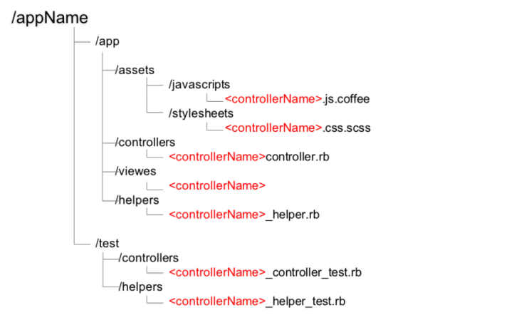

# Chapter2. RubyOnRails 기본

## 2.1 애플리케이션 작성

> 애플리케이션을 개발하려면 일단 골격을 작성해야한다!

1. 새로운 애플리케이션 생성

   ```text
   rails new appName [options]

   rails new railbook
   ```

2. 애플리케이션 구조 확인

굉장히 많은 폴더와 파일이 생성된다. 가장 많이 사용하는 폴더는 `/app`이다. 애플리케이션의 동작과 관련된 대부분의 코드는 이 폴더에 존재한다. 


1. HTTP 서버 실행

기본적으로 `WEBrick` 라는 간단한 서버를 표준으로 제공한다. 아래와 같은 명령어로 실행한다.

```text
rails server
```

## 2.2 컨트롤러의 기본

`MVC` 에서 컨트롤러를 담당하는 부분이다. 각각의 요청을 처리하는 본체. 비지니스 로직\(모델\), 그 결과를 출력\(뷰\)하는 것도 모두 _**컨트롤러 클래스**_ 가 하는 일이다. 즉 컨트롤러 클래스란 _**요청을 받고 응답을 생성하는 처리를 하는 ROR의 핵심이다.**_

### 2.2.1 컨트롤러 클래스 생성

> rails generate 명령어

```text
rails generate controller <name> <options>

rails generate controller hello
```

* 위의 명령어로 아래와 같은 파일들이 생성된다.



### 2.2.2 컨트롤러 클래스의 기본 구문

* 컨트롤러를 `rails generate controller hello` 명령으로 실행의 결과로 생성된 `hello_controller.rb` 파일을 열어보면 아래처럼 생겼다.

```ruby
class HelloController < ApplicationController
end
```

1. `ApplicationController` 상속
2. 주의 깊게 봐야할 건 `상속`이다. 모든 컨트롤러 클래스는 `ApplicationController` 클래스를 상송해줘야 한다. 이 클래스는 컨트롤러의 기본적인 기능을 제공하는 클래스다. `ApplicationController` 클래스가 요청이나 응답과 관련된 모든 처리를 해주므로 개발자는 앱 개발에 집중할 수 있다.
3. 구체적인 처리를 실행하는 것은 `액션 메서드`
4. `액션 메서드`는 클라이언트로부터의 요청을 처리하는 메서드다. 컨트롤러 클래스에는 하나 이상의 액션 메서드가 존재할 수 있다. 이런 액션 메서드를 관리하는 것이 컨트롤러 클래스.
5. 액션 메서드의 역할
6. 일반적으로 액션 메서드는 요청을 처리하거나 모델\(비즈니스 로직\)을 호출하고 뷰에서 사용되는 템플릿 변수를 설정하는 등 다양한 일을 한다.

### 2.2.3 라우팅 기초와 이해

* 라우팅이란 특정한 URL로 요청을 보냈을 때 _**요청을 처리할 대상을 지정하는 것 또는 그러한 구조 자체를 의미한다.**_
* Rails 는 클라이언트에서 요청을 받았을 때, 라우팅으로 호출해야 하는 컨트롤러와 액션을 결정한다.

### 2.2.5 컨트롤러 이름 규칙

> 설정보다 규약이 중요하다

* Rails를 고부하는 첫 단계는 관련된 파일 또는 클래스의 이름 규칙을 이해하는 것이다.
* `Controller`의 이름을 `hello`로 만들었을 때의 예시를 보자

| 종류 | 설명 | 예 |
| :--- | :--- | :--- |
| 컨트롤러 클래스 | 앞 글자는 대문자 뒤에 `Controller`라는 글자를 붙인다. | `HelloController` |
| 컨트롤러 클래스\(파일 이름\) | 컨트롤러 ㅋㄹ래스의 이름을 소문자로 만들고, 각 단어를 언더스코어\(\_\)로 구분한다. | `hello_controller.rb` |
| 헬퍼 파일 이름 | 컨트롤러 이름 뒤에 "\_helper.rb"를 붙인다. | `hello_helper.rb` |
| 테스트 스크립트 이름 | 컨트롤러 이름 뒤에 "\_controller\_test.rb"를 붙인다 | `hello_controller_test.rb` |

## 2.3 뷰 기본

* ROR에서 최정적인 출력은 `ERB(Embedded Ruby)`에서 사용하는 것이 기본이다.
* ERB는 `내장된` 이라는 뜻으로 `html` 문서에 내장된 루비라는 뜻이다.
* ;ERB의 장점은 아래와 같다.
  1. HTML 기반이므로 최종 출력을 예상하기 쉽다.
  2. Ruby 구문을 그대로 적용할 수 있다.
  3. `뷰 헬퍼`를 활용해 링크 또는 입력 양식을 쉽게 만들 수 있다.
  4. 임의의 Ruby 스크립트를 넣어 조건 분기 또는 반복 등의 처리를 자유롭게 적용할 수 있다.
  5. 뷰 헬퍼를 사용해 데이터베이스에서 추출한 데이터를 기반으로 링크 또는 입력 양식 요소 등을 간단하게 생성할 수 있다.

### 2.3.1 템플릿 변수 생성

* 액션 메서드에서 해야 하는 일 중 절대 빠뜨려서는 안 되는 일이 바로 _**템플릿 변수**_ 를 설정하는 것이다. 템플릿 변수는 템플릿 파일\(`ERB`\)에서 사용할 수 있는 변수로, 액션 메서드에서 데이터를 뷰로 전달할 때 사용하는 변수다.
* 액션에서는 출력하고 싶은 데이터를 준비하고, 템플릿에서는 해당 데이터를 어디에, 어떻게 출려할지를 정의한다.
* 이렇게 템플릿 변수로 _**뷰 - 컨트롤러 가 연결된다.**_

```ruby
class HelloController < ApplicationController
  ...
  def view
    @msg = 'hello world'
  end
end
```

> hello\_controller.rb

```text
...
<%= @msg %>
...
```

> /hello/view.html.rb

#### 2.3.2 템플릿 파일 작성

> 템플릿 파일이란 액션에서의 결과를 출력하기 위한 파일이다.

* 템플릿 파일은 `/app/views/<컨트롤러 이름>/<액션 이름>.html.erb`라는 이름으로 생성해야 한다.
* 동적 처리는 `<% ... %>` 또는 `<%= ... %>`로 입력 1. `<% ... %>`는 블록 내부의 코드를 실행한다. 출력이 없다. 연산만 된다. 2. `<%= ... %>`는 블록 내부의 값을 출력한다.
* 템플릿 변수는 `@<변수 이름>`으로 참조한다.

#### 2.3.3 공통 레이아웃

* 레이아웃을 사용하면 헤더나 푸터 또는 메뉴처럼 사이트 공통 디자인을 한꺼번에 적용할 수 있다.

## 2.4 모델 기본

* 모델이란 데이터베이스 또는 외부서비스에 접근하기 위한 비지니스 로직을 담당하는 컴포넌트다.
* `액티브 레코드`는 관계형 데이터베이스의 데이터를 객체로 조작하기 위한 방법을 제공한다.

### 2.4.1 O/R 맵퍼란?

* `O/R 맵퍼`는 관계형 데이터베이스와 객체 지향 언어의 객체 사이에 징검다리를 놓아주는 라이브러리다.
* 애플리케이션과 데이터베이스의 구조적인 차이를 `객체 관계 불일치(impedance mismatch)` 라고 부른다.
* `O/R 맵퍼`는 이러한 잘못된 매칭을 제거하기 위한 툴.
* 액티브레코드에서는 데이터베이스의 테이블 한 개로 모델 클래스 한 개를 생성한다.
  * 모델 클래스의 인스턴스는 레코드 한 개를 나타내는 객체 -&gt; 테이블의 행
  * 객체의 속성은 테이블의 필드 -&gt; 테이블의 열

### 2.4.3 모델 클래스 생성

* 컨트롤러를 생성할 때 사용했던 `rails generate`를 사용한다.

```text
rails generate model name field:type ... [options]

rails generate model book isbn:string title:string price:integer
```

* 모델의 이름 규칙은 아래와 같다

| 종류 | 설명 | 예 |
| :--- | :--- | :--- |
| 모델 클래스 | 첫 글자를 대문자로 하고 단수형으로 사용 | `Book` |
| 모델 클래스의 파일 이름 | 첫 글자를 소문자로 하고 단수형으로 사용 | `book.rb` |
| 테이블 | 첫 글자를 소문자로 하고 복수형으로 사용 | books |
| 테스트 스크립트 | `xxxxx_test.rb`\(첫 글자는 소문자로 하고 단수형으로 사용\) | book\_test.rb |

### 2.4.4. 마이그레이션 파일로 테이블 생성

* 마이그레이션이란 테이블 레이아웃을 생성 또는 변경하기 위한 구조다. 프로그램 작성 도중에 레이아웃을 변경하는 일이 생기더라도 마이그레이션을 이용해 쉽게 변경할 수 있다.
* 변경이라면 열\(속성\)의 추가 그리고 타입 등을 변경 할수 있다는건가?

### 2.4.6 데이터베이스 클라이언트 실행

```text
rails dbcondole 명령어
```

