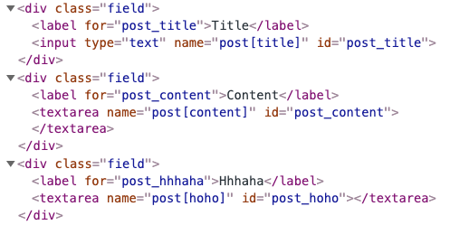
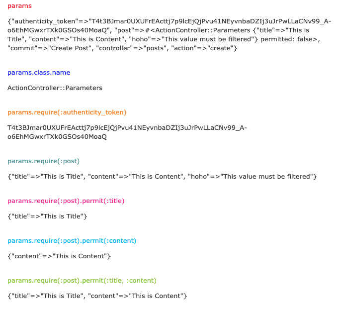

# form으로 전달되는 params를 분석해보자

## `form_with` 에서 `params` 을 분석해보자

> 흠... 어렵군

### 1. `form_with` 로 인해 생성되는 `html` 파일을 개발자 도구로 분석하자

* `input box`를 보면 `name="post[title]"` 와 `name="post[content]"` 을 볼 수 있다. \(`hoho` 는 나중에 필터링 해야함 \)



### 2. 제출 버튼을 누르기 전에 액션 메서드와 VIEW를 조금 수정하자

* 버튼을 누르면 `create` 액션 메서드가 실행이 되고 바로 다른 페이지르 `redirect` 되어 버린다. 그렇게 되면 `create` 액션 메서드를 디버깅 할 수 없다.
* `create` 메서드에서 실행되는 부분을 다 지우자.

  ```ruby
  def create
  end
  ```

* 이후에는 `create` 액션 메서드와 소통하는 `view` 를 만들자. `create.html.erb`를 만들면됨.

  ```ruby
  <%= params %>
  ```

### 3. 제출 버튼을 누르고 그 결과를 확인해보자

* `params` 의 클래스 이름은 `ActionController::Parameters`
* `params`는 내부적으로 `해쉬` 의 형태를 갖는다
* 입력값은 `post` 를 `key` 로 하는 `value` 에 들어있다. \(`{"title"=>"This is Title ....."}` `value` 또한 해쉬다.\)
* 위 분석을 통해 `input 박스` 에 입력값을 넣고 제출을 누르면 `name=객체[속성]`, `입력값` 이 아래처럼 들어오게 된다는 것을 알았다.

  ```ruby
  params = ActionController::Parameters.new({
    name: {
      속성1: "입력값",
      속성2: "입력값"
    }
  })
  ```



### 4.  입력값 가져오기

* 우리의 입력값이 아래와 같다는 걸 알았다. 그리고 `params` 객체의 클래스 이름이 `ActionController::Parameters` 라는 것도 알게됐으니 [공식홈페이지](https://api.rubyonrails.org/classes/ActionController/Parameters.html#method-i-require) 의 설명을 잠깐 보고오자.

  ```markup
  {"authenticity_token"=>"pWnCBsjL8gBiQQAUjRYzP9E3a2_s9ai_RuEVRPOw4K70DI-qEiw5HwwXVBdOj0bnw3QW2HO8mwLVVXXha2fesg", "post"=>#<ActionController::Parameters {"title"=>"This is Title", "content"=>"This is Content", "hoho"=>"This is Useless"} permitted: false>, "commit"=>"Create Post", "controller"=>"posts", "action"=>"create"}
  ```

* 현재 `params` 는 5 쌍의 `key - value` 를 갖고 있다.
  1. `authenticity_token` - 보안관련. 나중에 보자.
  2. `post` - _**우리가 입력한 데이터가 들어가있다.**_
  3. `commit` - 이건 뭔지 모르겠다.
  4. `controller` - 컨트롤러
  5. `action` - 액션 메서드
* 이제 순서를 생각해보면 아래와 같다.
  1. `params`에서 2번의 `post` 를 키로 하는 `value` 를 가져온다.`value`는 해시의 형태를 갖고 있다. 해시의 `key` 는 모델 객체의 `속성` 이다.
  2. `value` 에서 모델 객체에 속하지 않는 `key` 를 필터링 한다.
* 위의 1번의 `post`를 가져오는 방법은

  ```ruby
  params.require(:post)
  ```

* 2번에서 필터링 하는 방법은 \([필터링을 하는 이유](https://chancethecoder.tistory.com/8)\)

  ```ruby
  params.require(:post).permit(:title, :content)
  ```

### 5. 입력값을 이용해 새로운 모델 객체 만들기

* 4번의 최종 결과는 모델을 새로 만드는데 필요한 데이터다.
  * 그리고 이 데이터는 해시의 형태다.
* 따라서 이제 `create` 액션 메서드에서 새로운 모델 객체를 만들자.

  ```ruby
  def create
    @post = Post.new(params.require(:post).permit(:title, :content))
  ```


