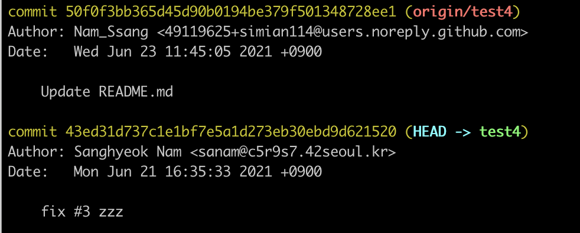
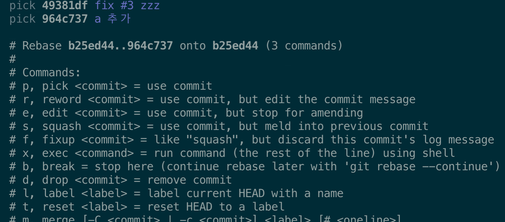

# 기본 사용법 정리



### git 사용법

프로젝트를 `git` 으로 관리하기 시작하면 모든 파일들은 4가지 상태\(`life cycle`\)가 된다.

1. `untracked`
2. `Unmodified`
3. `Modified`
4. `Staged`

#### Untracked

추적\(버전관리\)되지 않는 파일을 의미한다. `git` 으로 관리하는 프로젝트에서 `Untracked` 의 상태를 갖는 파일은 보통 새로 만들어진 파일을 의미한다. 구태여 `Untracked` 상태로 내버려둘 필요가 없기 때문이다. 만약 해당 파일을 추적하고 싶지 않다면 `.gitignore` 를 이용한다.

#### Unmodified

추적 되고 있는 파일이면서 마지막 커밋을 기준으로 아직 수정이 되어있지 않은 상태다. 해당 상태는 `git status` 명령어를 입력해도 아무것도 볼 수 없다.

#### Modified

추적 되고 있는 파일이 직전 커밋을 기준으로 수정이 되고 새롭게 `stage` 로 올라가지 않은 상태.

#### Staged

추적되고 있지 않은 파일을 추적하기 위해 또는 추적 되고 있지만 변경 사항이 있을 때 `add` 명령어를 통해 `Staged` 상태로 만든다. `Staged` 되어있는 상태에서 `commit` 이 되면 해당 파일의 상태는 `Unmodified` 가 된다. `commit` 가 된다는 것은 버전을 새롭게 한다는 것을 의미한다. `git log` 명령어를 입력하면 `commit` 이력을 확인할 수 있다.

위 4가지 상태를 이해하고 기본 명령어 및 사용법을 알아보자.

#### 기본 명령어

1. `init`
   * 프로젝트를 `git` 으로 버전관리를 시작한다.
2. `add`
   * `Untracked` 파일을 `Staged` 상태로 만든다.
   * `Modified` 파일을 `Staged` 상태로 만든다.
3. `commit`
   * `Staged` 된 파일에 버전을 준다.
   * `commit` 된 파일들은 `Unmodified` 상태가 된다.
4. `branch`
   * `git branch <branch>` 새로운 브랜치를 생성한다.
     * 생성된 브랜치는 현재 브랜치의 형상을 그대로 가지는 브랜치가 생성된다.
   * `git branch -d <branch>` 브랜치를 삭제한다.
   * `git branch -D <branch>` 브랜치를 강제로 삭제한다.
5. `checkout`
   * 브랜치를 변경한다.
   * `git checkout -b <branch>` 를 통해 브랜치 생성, 이동을 동시에 할 수 있다.
6. `remote`
   * 원격 저장소와 관련된 명령어.
   * `git remote add <name> <url>` 원격저장소를 `name` 으로 추가함
     * 주로 `git remote add origin <url>` 처럼 `origin` 으로 사용하는 경우가 많음
     * 이렇게 이름을 지정해서 추가할 수 있다는 건 하나의 로컬 저장소에 여러 개의 원격 저장소를 추가할 수 있다는 이야기가 됨
   * `git remote update` 로 원격저장소의 정보를 업데이트 한다.
     * `git fetch` 와 기본적으로 동일하다. `fetch` 는 현재 브랜치만을 업데이트 한다면 `remote update` 는 모든 브랜치를 대상으로 `fetch` 를 해온다.
7. `push`
   * 현재 로컬의 커밋 내용을 원격저장소에 올린다.
   * `git push <원격저장소이름> <브랜치명>` 으로 올림
   * ‼️`push` 을 할 때는 먼저 원격저장소의 브랜치가 내 로컬 저장소의 브랜치보다 앞서 있는지를 확인해야한다.
     * 팀원이 같은 브랜치에 먼저 `push` 를 해놓은 상태면 내 로컬과 맞지 않는 상태가 되어서 문제가 발생할 수 있기 때문이다.
     * 만약 원격저장소가 앞서 있다면, 먼저 `pull` 을 이용해 로컬 브랜치를 최신화 하는 작업이 필요하다.
   * ⚡ `git push origin —-delete <branch>` 로 원격저장소의 브랜치를 삭제할 수 있다!
8. `pull`
   * 원격 저장소에 있는 내용을 로컬 저장소로 가져온다.
   * `git pull <원격저장소이름> <브랜치명>`
   * ‼️ 원격저장소가 내 로컬 저장소와 차이가 있을 때 `conflict` 가 발생할 수 있다.
   * `pull` 은 `fetch + merge` 다.
9. `fetch`
   * 원격 저장소에 있는 내용을 가져온다.
   * ‼️ 가져오기만 하지 병합하지는 않는다.
     * 이 말은 원격 저장소에 있는 내용을 현재 저장소로 가져오지만, `pull` 과는 다르게 현재의 내용에 원격 저장소의 내용을 덮어 씌우지는 않는다는 것이다.
   * `git log HEAD origin/<branch>` 를 통해서 현재 로컬의 브랜치와 원격 저장소 브랜치의 차이를 확인할 수 있다.

     

     * `test4` 브랜치는 현재 원격 저장소가 로컬 저장소보다 앞서있다.

   * `git diff HEAD origin/<branch>` 명령어를 통해 그 차이를 터미널로 확인할 수 있다.
   * `git merge origin/<branch>` 를 통해 원격 저장소의 내용을 병합할 수 있다.
     * ‼️ `pull` 과 마찬각지로 `confilct` 가 발생할 수 있다.
10. `merge`
    * 원격 저장소 브랜치와 병합, 로컬 브랜치 사이의 병합에 사용된다.
    * 주로 특정 기능을 추가할 때 로컬에서 `feat/Comment` 와 같은 브랜치를 만들고 해당 브랜치에서 작업을 한뒤 `commit` 까지 마무리하면 다시 이전의 브랜치로 돌아와서 `git merge feat/Comment` 로 작업사항을 `merge` 한다.
11. `stash`
    * 마지막 커밋을 기준으로 변경된 사항을 잠시 어딘가에 저장하고 싶을 때 사용할 수 있다.
    * `git stash` 를 이용하면 `Modified`, `Staged` 상태의 변경사항을 스택에 저장한다.
      * ‼️ `Untrakced` 파일은 스택에 저장하지 않는다.
    * 그러면 언제 `stash` 를 주로 사용하는가?
      * 현재 브랜치에서 어떤 작업을 하고 있는데, 현재의 작업을 마무리하지 않은 상태로 다른 브랜치의 작업을 해야하는경우. `stash` 를 이용해서 현재의 작업 내용을 `stash` 스택에 저장하면 현재 브랜치는 마지막 커밋의 상태로 돌아가게 된다. 변경사항만 `stash` 스택에 저장되게 된다.
    * `git stash list` 를 통해 `stash` 리스트에 저장된 내용들을 볼 수 있다.
    * `git stash pop` 를 통해 가장 마지막으로 `stash` 스택에 들어온 내용을 가져올 수 빼올 수 있다.
      * ‼️ `stash` 로 스택에 변경사항을 push 한 저장소와 `pop` 하는 브랜치가 달라도 된다
12. `rebase`
    * 커밋의 `base` 를 다시 정하는 작업이다.
    * 일반적으로 `git merge` 명령어로 두 브랜치를 병합하게 되면 `log` 가 꼬여버리는 상황이 발생한다.
      * 그동안 쌓아왔던 내 브랜치의 `commit` 로그 중간중간 `merge` 된 브랜치의 커밋 로그가 들어옴
    * `rebase` 를 사용하면 깔끔한 커밋 히스토리를 남길 수 있게 된다.
    * 사용법
      1. `develop` 브랜치와 새로운 기능을 추가한 `feat/comment` 브랜치가 있다고 하자. 이 `feat/comment` 브랜치 작업이 마무리 되서 `develop` 브랜치에 합쳐야 하는 상황.
      2. `git rebase <병합 목적 브랜치> <병합 시킬 브랜치>` 으로 `rebase` 를 시킨다.
         * `git rebase develop feat/comment`
      3. `git checkout develop`
      4. `git merge feat/comment` 이렇게 깔끔한 히스토리가 만들어지게 된다.
    * 원리
      1. `git rebase develop feat/comment` 명령어를 입력하면 아래와 같은 동작이 실행된다.
         1. `git checkout feat/comment` 를 통해 HEAD를 `feat/comment` 로 이동시킨다.
         2. `develop` 브랜치와 `feat/comment` 브랜치의 공통 조상이 되는 커밋부터 `feat/comment` 브랜치의 모든 커밋에 대해 `diff` 를 하고 그 차이\(변경사항\) 을 로컬에 저장한다.
         3. 이 결과로 `develop` 브랜치의 앞에는 `feat/comment` 에서의 변경사항이 추가되게 된다. `fetch` 와 비슷하게 명목상으로 된 상태고 병합은 아직 되지 않은 상태다.
      2. `git checkout develop && git merge feat/comment` 를 하면 병합이 되고 히스토리가 깔끔하게 한줄로 만들어짐

### 커밋 변경

커밋 변경은 아래와 같은 상황에서 사용할 수 있다.

* 커밋에 포함되어야 하는 변경사항을 `add` 하지 않은 상태에서 `commit` 한 경우
* `commit` 메세지를 잘못 작성한 경우 등...

커밋 변경은 크게 바로 직전 커밋과 직전이 아닌 커밋 변경으로 나누어진다.

#### 직전의 커밋을 수정

1. `commit` 메세지 만을 수정
   * `git commit --amend`
2. 변경사항을 추가
   * `git add <file> && git commit --amend`

#### 직전이 아닌 특정 커밋을 수정할 경우

1. `git log` 를 통해 수정하고 싶은 커밋의 이전 커밋의 `id` 를 복사한다.
2. `git rebase -i <commit id>` 를 입력하자.

   

   * 무엇을 어떻게 해야하는지에 대한 설명이 간략하게 나와있다.

3. 변경하고 싶은 커밋을 찾고 `pick` 을 `edit` 으로 바꾼뒤 `wq` 로 저장하고 나오자
   * 여러 커밋을 `edit` 해도 된다.
4. `edit` 으로 설정된 커밋 중에서 가장 오래전 커밋부터 수정하면 된다.
5. 수정사항을 추가한 뒤 `git add ... && git commit --amend` 로 커밋을 하자.
6. 이후에는 `git rebase --continue` 명령어로 다음 `edit` 으로 가면된다. 만약 마지막 `edit` 이었다면 기존에 작업중이던 브랜치로 돌아오게 된다.

### 깃 브랜칭 전략

큰 틀로써 `master`, `develop`, `release` 세 브랜치가 존재한다. 그리고 개발자들은 자신이 맡은 기능에 따라 **임시로 브랜치를 만들고 관리하게 된다.**

1. `master`
   * 한 스프린트가 끝나면 각 스프린트의 내용을 `master` 에 합친다.
   * 다음 스프린트는 `master` 브랜치에서 `develop` 을 따고 시작한다.
2. `develop`
   * 실제 개발을 진행하는 브랜치.
   * 스프린트가 끝나면 `develop` 브랜치에 머지한다.
   * 깃허브의 기능을 이용하기 위해서는 해당 브랜치를 디폴트 브랜치로 설정하는게 좋다.\(자동으로 `issue` 클리어 해줌\)
3. `release`
   * `master` 에서 출시 할 수 있는 버전이 있으면 `release` 로 만든다.
   * 출시된 버전이 없다면 `release` 브랜치는 없어도 된다.
4. 임시 브랜치
   * `feat/...`, `fix/...` 임시로 만들어지는 브랜치들은 브랜치 이름으로 브랜치의 목적을 명확히 알 수 있게 만든다.

